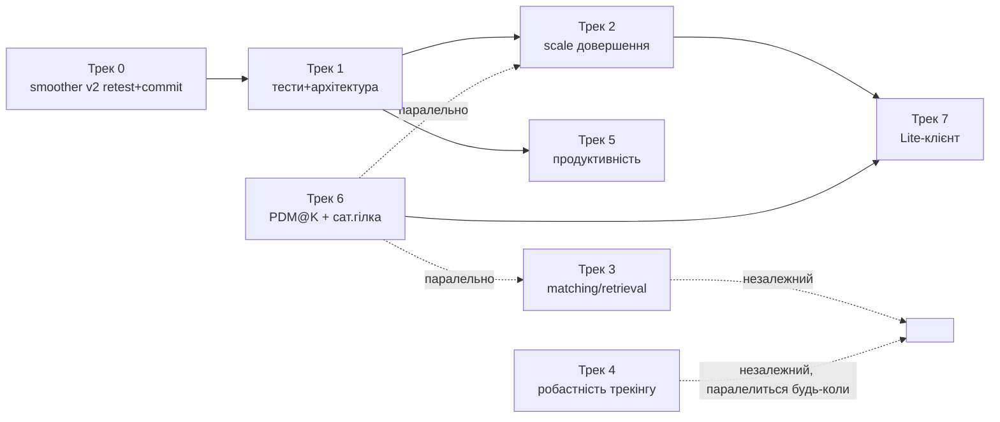

# Зведений план залишкових задач

Дата збірки: 2026-07-18. Джерело: усі задачі зі статусом "відкрито"/"залишилось" в
`.agents/` та `docs/` станом на цю дату (аудит — окрема сесія того ж дня). Документ
не дублює деталі — там, де рішення чи формули вже описані в профільному плані,
тут лише посилання. Дедуплікація: кілька старих планів пропонували ту саму задачу
різними словами (PatchTokenPooling, GIM, RoMa, Mahalanobis/PF, супутниковий режим) —
нижче кожна така задача одна, з переліком усіх джерел.

**Профільні плани лишаються живими джерелами деталей, цей документ їх не замінює:**
`IMPROVEMENT_PLAN.md`, `IMPLEMENTATION_PLAN.md`, `SCALE_INVARIANCE.md`,
`RESEARCH_INTEGRATION_PLAN.md`, `PERFORMANCE_ACCURACY_PLAN.md`,
`CALIBRATION_IMPROVEMENT_PLAN.md`, `SOTA_RESEARCH.md`, `LITE_CLIENT_PLAN.md`,
`SENIOR_REVIEW.md`.

---

## Трек 0 — Негайне (уже зроблено, чекає підтвердження)

| Задача | Джерело | Стан | Дія |
|---|---|---|---|
| Fixed-lag servo smoother v2 | пам'ять сесії, `RESEARCH_INTEGRATION_PLAN.md` §3.1 | Код у пісочниці зелений (unit-тести), незакомічено: `config/localization.py`, `src/localization/localizer.py`, `src/tracking/smoother.py`, `tests/test_smoother.py`, `user_config.json(.example)` | Живий прогін на Windows (перевірити, що траєкторія не сіпається до фіксів) → комміт |

---

## Трек 1 — Тести та архітектура (страховка для решти треків, робити першим)

Цінність: без цього кожен наступний рефакторинг (2, 5) — навмання. Ризик — низький,
це головним чином move+тести, не зміна математики.

| Задача | Джерело | Зусилля | Гейт |
|---|---|---|---|
| Integration flow test (`tests/integration/test_full_cycle.py`): synth-відео → build → 2 якорі → пропагація → локалізація → медіанна похибка < GSD-порогу | `IMPROVEMENT_PLAN.md` п.4.5 | S | компіляція + прохід у CI |
| `database_builder.py` розбиття на `video_frame_source/keyframe_selector/frame_processor/db_writer/keypoint_video_writer` | `IMPROVEMENT_PLAN.md` п.1.3 | M | семантика "поза завжди, keyframe вибірково" і frame_id↔slot identity зафіксовані тестом до рефакторингу |
| `calibration_propagation_worker.py` → `PropagationPipeline` (без Qt, тонкий QThread-обгортка) | `IMPROVEMENT_PLAN.md` п.1.4 | S (майже механічний move) | ті самі тексти прогрес-сигналів для GUI |
| `model_manager.py` → `models/vram.py` (VramBudget) + `models/registry.py` (ModelRegistry) + `models/loaders/*`, фасад зі старими методами | `IMPROVEMENT_PLAN.md` п.1.6 | M | `_model_lock` і далі охоплює load+evict атомарно; DINOv3 лишається під іменем "dinov2" у реєстрі |
| MainWindow: mixins → контролери (`AppContext` + `*Controller(QObject)`), інкрементально по одному міксину | `IMPROVEMENT_PLAN.md` п.2.1, `SENIOR_REVIEW.md` п.7 | L (2-3 дні) | перед міграцією — grep усіх `self.<attr>` кожного міксина, явний перелік спільного стану |
| `get_cfg()` → типізований Pydantic-доступ (винести PyInstaller-хак в `utils/paths.py`, прибрати dict-дуальність, deprecate `get_cfg`) | `IMPROVEMENT_PLAN.md` п.2.3 | L (147 викликів, робити разом з рефакторингом модулів, не окремо) | `test_config_sync.py` розширити |
| mypy для `src/geometry`, `src/localization`, `config` у CI (там `X \| None` вже уніфіковано) | `SENIOR_REVIEW.md` п.8 | S–M | — |

---

## Трек 2 — Довершення scale-інваріантності (найвищий дослідницький пріоритет)

Ядро (ScaleManager, FOV-remap, depth-hint) уже закомічено. Лишилось довести до
acceptance-критерію епіка і піти далі за r>2.5.

| Задача | Джерело | Зусилля | Гейт |
|---|---|---|---|
| `tests/test_scale_invariance.py` — acceptance-тест: синтетичні r∈{0.5,0.7,1.4,2.0} → `localize_frame` → медіанна помилка ≤ 2× базової + тест FOV-полігона | `IMPLEMENTATION_PLAN.md` Фаза 1, `SCALE_INVARIANCE.md` Етап 3 | S | сам і є критерій завершення Фази 1 |
| PatchTokenPooling: 1 forward → grid avg-pool патч-токенів замість 14-кропного patchify; інтеграція в `CandidateRetriever.expand()` | `IMPLEMENTATION_PLAN.md` Фаза 2, `IMPROVEMENT_PLAN.md` п.5.1, `SOTA_RESEARCH.md` roadmap #2 | M (3-4 дні) | бенчмарк проти кропового patchify (recall + час) на еталонному відео |
| Ортомозаїка + tile-піраміда рівнів GSD (×1/×2/×4, LanceDB-колонка `level`) | `IMPLEMENTATION_PLAN.md` Фаза 5, `SCALE_INVARIANCE.md` Етап 4 | L (2-3 тижні) | розріз r∈[2.5,4]: помилка ≤ 3× baseline |
| Супутниковий режим (`satellite_converter.py`, тайли → БД без пропагації) + MINIMA-ваги як `matcher.backend` | `IMPLEMENTATION_PLAN.md` Фаза 6, `SCALE_INVARIANCE.md` Етап 5, `SOTA_RESEARCH.md` roadmap #8 | L (місяць+) | окремий retrieval-бенчмарк; актуальність підтвердити перед стартом |

---

## Трек 3 — Якість матчингу/retrieval (незалежні задачі, кожна власним бенчмарк-гейтом)

| Задача | Джерело | Зусилля | Гейт |
|---|---|---|---|
| GIM-ваги для LightGlue, A/B проти поточних (звужено: лише для `superpoint`-пайплайна, `scripts/benchmark_matcher.py` створити) | `IMPLEMENTATION_PLAN.md` Фаза 3a (errata-звужена), `SOTA_RESEARCH.md` roadmap #1 | S (години–1 день) | inliers/A@5m/мс на еталоні; рішення за результатом |
| RoMa v2 як офлайн-матчер у `CalibrationPropagation` (temporal+spatial ребра) | `IMPLEMENTATION_PLAN.md` Фаза 3c, `SOTA_RESEARCH.md` roadmap #5 | L (~тиждень) | медіанний inlier/RMSE ребер кращі за LightGlue-варіант; перевірити співіснування VRAM з пайплайном збудови |
| Навчена агрегаційна голова retrieval (SALAD-стиль поверх патч-токенів, донавчена на власних сусідніх keyframes) | `SOTA_RESEARCH.md` roadmap #6 | L (1-2 тижні, потребує ~1 GPU-день навчання) | R@1/PDM@K проти поточного CLS |
| DSM + PnP для oblique-ракурсів/малих висот | `SOTA_RESEARCH.md` roadmap #9 | L (місяць+) | лише якщо з'являться місії поза nadir-зйомкою — не пріоритет зараз |

---

## Трек 4 — Робастність трекінгу

| Задача | Джерело | Зусилля | Гейт |
|---|---|---|---|
| Mahalanobis-гейт в `OutlierDetector` (χ² від KF-коваріації замість Z-score) | `IMPLEMENTATION_PLAN.md` Фаза 4a, `SOTA_RESEARCH.md` roadmap (трекінг) | S (2-3 дні) | незалежний від retrieval, можна паралелити з треком 2 |
| Particle Filter як опційний `tracking.backend` (кластеризований PF, патерн SPRIN-D) | `IMPLEMENTATION_PLAN.md` Фаза 4b, `SOTA_RESEARCH.md` roadmap #7 | L (1-2 тижні) | сценарій «виліт за покриття → повернення» відновлюється без ручного reset; не гірше KF на штатному сценарії |

---

## Трек 5 — Продуктивність (десктоп)

| Задача | Джерело | Зусилля | Ефект |
|---|---|---|---|
| TensorRT для DINOv2/v3 дефолтом (`models.performance.use_tensorrt_*`) | `PERFORMANCE_ACCURACY_PLAN.md` A4 | M (0.5 дня + компіляція двигунів на цільовому GPU) | ViT-L у TRT FP16 ≈ 2-3× швидше |
| Справжні батчі в `database_builder.py` (`extract_features_batch`, yolo_batch_size 4-8) | `PERFORMANCE_ACCURACY_PLAN.md` A5, `DB_INTERCHANGEABILITY.md` §4 | M (реструктуризація циклу builder) | +30-60% пропускної здатності збудови; **перевірити на реальному GPU, що побатчовані per-frame виходи не змінюються** — інакше ламає interchangeability БД |
| Гео-гейтинг кандидатів retrieval у single-DB режимі (переконатись, що `GeoAwareRetriever`/`SpatialIndex` активні й там) | `PERFORMANCE_ACCURACY_PLAN.md` B7 | S | менше хибних кандидатів на однорідних текстурах, швидше |

---

## Трек 6 — Методологія (спільна залежність для кількох треків)

| Задача | Джерело | Зусилля | Чому важливо |
|---|---|---|---|
| PDM@K метрика в тестовий контур | `RESEARCH_INTEGRATION_PLAN.md` §3.2 | S | гейт для Track 2 (Lite-план п.1) і для оцінки будь-якого retrieval-експерименту в Track 3 |
| Деградована супутникова гілка оцінки (та сама місцевість із супутникових тайлів замість Cesium) | `RESEARCH_INTEGRATION_PLAN.md` §3.2 | M | без неї всі A/B-цифри з Flightmare-футажу систематично оптимістичні (розрив 74.1% vs 18.5% з AnyVisLoc) |
| Windows mission-benchmark як фінальний гейт перед мержем стадії 8 калібрування | `CALIBRATION_IMPROVEMENT_PLAN.md` (стандартна вимога) | S (запуск, не розробка) | стадія 8 сама по собі готова в пісочниці; це формальність, а не відкрита розробка |

---

## Трек 7 — Lite-клієнт (окрема велика ініціатива, draft v1, нічого не почато)

Consume-only клієнт для слабких машин/Android. Джерело: `LITE_CLIENT_PLAN.md`
(2026-07-18, статус: жодна стадія не почата).

| Стадія | Що | Зусилля | Гейт входу в наступну |
|---|---|---|---|
| 0. Виміряти, не вгадувати — force-CPU прогін поточної апки на десктопі + реальному старому ноуті, розширити Telemetry per-model | S | інформаційна, без гейту |
| 1. Lite runtime-профіль (`user_config.lite.json`, конфіг-делти + дрібні флаги коду) | S–M | mission benchmark: деградація точності ≤25% на 2 сценах; залежить від PDM@K (Трек 6) |
| 2. CPU inference backend (ONNX Runtime, per-model torch-cuda\|torch-cpu\|ort-cpu) | M | keyframe ≤3с на референс-машині T-A |
| 3. Diet retrieval-бекбону (DINOv2-S/B замість ViT-L, десктопний ребілд БД + бенчмарк) — вирішальна стадія | M–L | точність у бюджеті на Flightmare **і** на супутниковій деградованій гілці (Трек 6) |
| 4. Lite-пакування (PyInstaller CPU-only профіль) | S–M | холодний старт ≤30с, RAM ≤3ГБ, живий прогін на реальному старому ноуті |
| 5. Android (design-only до проходження вхідного гейту) | L | ORT-бенчмарк на реальному телефоні: keyframe ≤5-8с, RAM ≤2ГБ; інакше — телефон лишається лише дисплеєм |

---

## Рекомендований порядок

Пояснення нелінійності: Трек 3 (GIM/RoMa/агрегаційна голова) і Трек 4 (Mahalanobis/PF)
не залежать від Треку 1-2 і можуть паралелитись будь-коли — вони самі себе гейтують
бенчмарком. Трек 7 (Lite) свідомо останній: його стадія 3 вимагає супутникової
деградованої гілки з Треку 6, інакше цифри lite-точності будуть оптимістичними.

### Конкретна черга виконання

Розгортка графа вище в один робочий потік (стан на 2026-07-18). Принципи: спочатку
незакомічене і дешеві методологічні гейти, потім страхувальні тести, потім довгі
рефакторинги та дослідження. Будь-який A/B, що вирішує «приймаємо/ні», — після
PDM@K; вирішальні рішення — після супутникової гілки.

1. **Windows-сесія підтверджень** — Трек 0 (живий прогін smoother v2 → комміт) +
   mission-benchmark стадії 8 з Треку 6 (→ мерж). Обидва пункти — запуск і
   підтвердження, не розробка; батчаться в одну сесію.
2. **PDM@K у тестовий контур** (Трек 6, S) — розблоковує гейти всіх подальших
   retrieval-експериментів; далі нічого дослідницького без неї не міряти.
3. **Два страхувальні тести** (обидва S, взаємно незалежні): acceptance-тест
   scale-інваріантності (Трек 2, закриває Фазу 1) та integration flow test
   (Трек 1) — до будь-якого рефакторингу чи зміни матчингу.
4. **Трек 1, рефакторинги за зростанням ризику**: PropagationPipeline (S) →
   розбиття `database_builder` (M) → `model_manager` (M) → MainWindow-контролери (L).
   `get_cfg`-типізацію мігрувати інкрементально всередині кожного з цих
   рефакторингів, не окремим проходом; mypy в CI — замикання треку.
5. **Паралельна дослідницька гілка** (старт будь-коли після п.2, від п.4 не
   залежить): GIM A/B (Трек 3, S) → Mahalanobis-гейт (Трек 4, S). RoMa,
   агрегаційна голова, Particle Filter — лише якщо відповідний бенчмарк/сценарій
   це виправдає.
6. **Супутникова деградована гілка** (Трек 6, M) — до вирішальних A/B
   (PatchTokenPooling, рішення по RoMa/голові) і обов'язково до Lite; дешеві
   результати п.5 після неї переперевірити.
7. **Трек 5**: TensorRT-дефолт (M) і гео-гейтинг single-DB (S) — будь-коли;
   батчі `database_builder` (M) — строго після розбиття з п.4.
8. **Трек 2, дослідницьке ядро**: PatchTokenPooling (M) → ортомозаїка +
   tile-піраміда (L) → супутниковий режим (L; перед стартом підтвердити
   актуальність).
9. **Трек 7 Lite** — стадії 0→5 строго послідовно; вхід після п.6 і ядра
   Треку 2 (п.8).

Поза чергою: DSM + PnP (Трек 3) — лише при появі non-nadir місій.

Нюанс, який граф не показує: з усього Треку 1 справжнім пре-реквізитом для
дослідницьких треків є лише integration flow test (п.3); батчі Треку 5 гейтяться
саме розбиттям `database_builder`, а не Треком 1 цілком. Тому п.5 законно йде
паралельно п.4.

## Що свідомо НЕ в цьому плані

Відхилені/скасовані підходи (robust loss `soft_l1`, `s_ref`-нормалізація ваг, GTSAM
Pose3/iSAM2, SALAD як є, IndexHNSWFlat) — залишені в профільних документах
(`RESEARCH_INTEGRATION_PLAN.md` §4, `PERFORMANCE_ACCURACY_PLAN.md` B3/B3a) як записи
"це вже пробували, не працює". Не переносити сюди й не видаляти звідти — вони існують
саме для того, щоб цю роботу не повторили.
