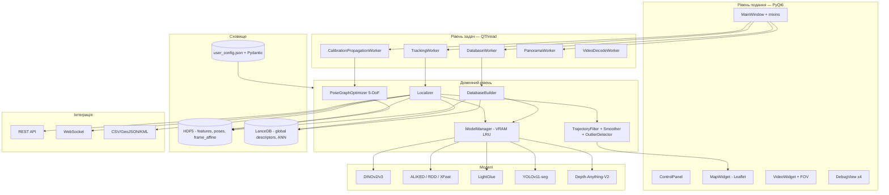
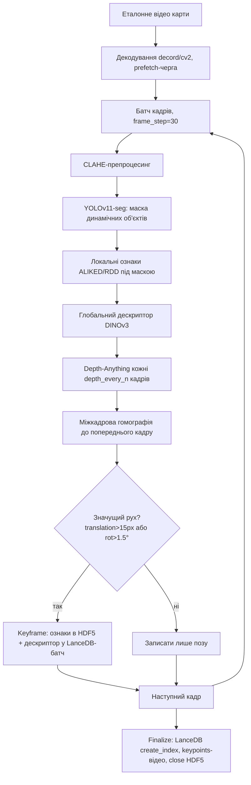
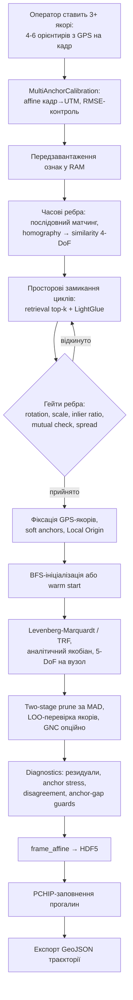
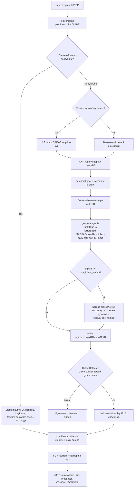
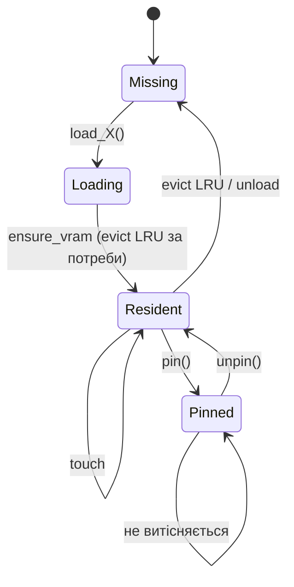
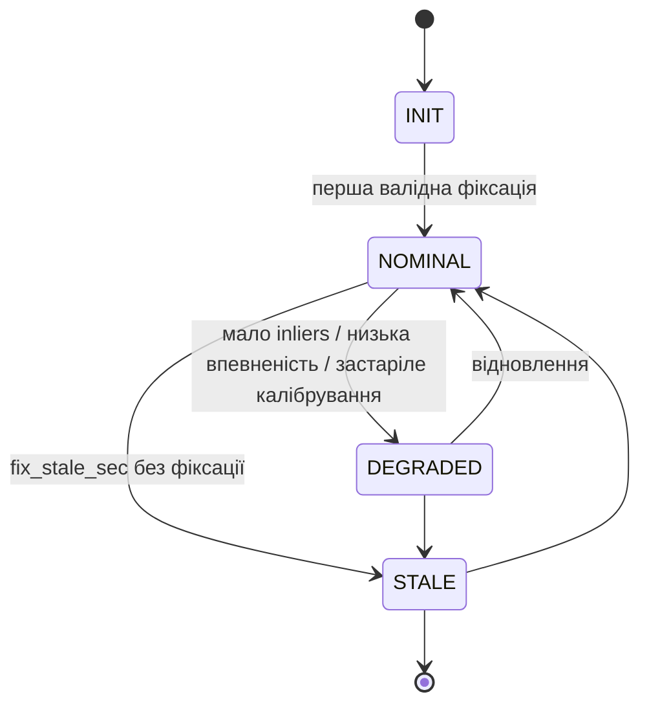
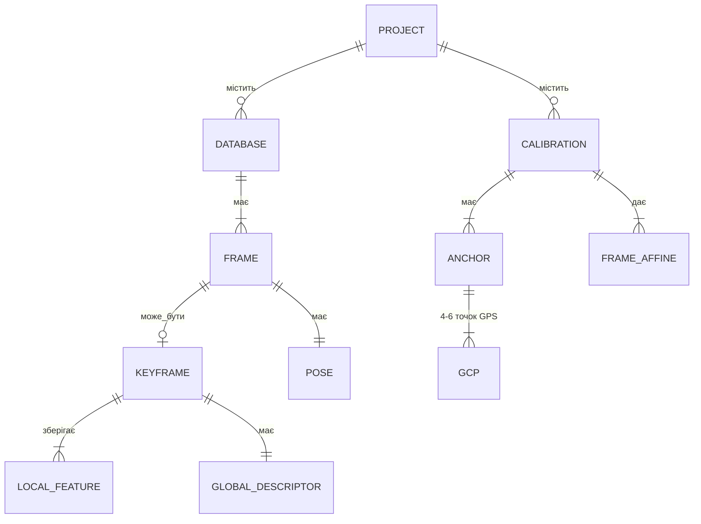

# Матеріал для магістерської роботи — DroneLocalization

> Джерело: аналіз реального коду репозиторію (`src/`, `config/`, `tests/`, `docs/architecture.md`, `user_config.json`) станом на 2026-08-03, HEAD `01e303e`, 162 коміти, ~24 300 рядків Python у `src/`.
> **Прапорець:** усе нижче — опис *реалізованого* функціоналу, виведений з коду. Жодних числових показників точності (RMSE, FPS, recall) тут немає — їх не можна отримати з коду, лише з прогонів на Windows. Розділ 7 фіксує, які саме заміри потрібно зробити, щоб робота мала експериментальну частину.

---

## 1. Що вже готове (короткий підсумок)

Система — це закінчений desktop-продукт (PyQt6) + headless-сервіс для топометричної візуальної локалізації БПЛА без GPS. Готові й робочі підсистеми:

| # | Підсистема | Ключові модулі | Статус |
|---|---|---|---|
| 1 | Побудова бази еталонних кадрів з відео | `src/database/database_builder.py`, `keyframe_selector.py`, `keypoint_video_writer.py` | готово |
| 2 | Гібридне сховище HDF5 + LanceDB (ANN) | `database_loader.py`, `spatial_index.py`, `schema_fingerprint.py` | готово |
| 3 | Глобальні дескриптори (DINOv2 / DINOv3-SAT493M) | `models/wrappers/dinov3_wrapper.py`, `vlad_aggregator.py`, `trt_dinov2_wrapper.py` | готово (VLAD/CESP — flag-gated off) |
| 4 | Локальні ознаки + матчинг (ALIKED / RDD / XFeat / SIFT + LightGlue) | `models/wrappers/*`, `localization/matcher.py` | готово |
| 5 | Маскування динаміки YOLOv11-seg | `masking_strategy.py`, `yolo_wrapper.py` | готово |
| 6 | Монокулярна глибина Depth-Anything-V2 | `src/depth/depth_estimator.py` | готово (як hint, off) |
| 7 | Мульти-якірне GPS-калібрування + 5-DoF pose-graph LM | `src/geometry/pose_graph/*`, `src/calibration/*`, `workers/calibration_propagation_worker.py` | готово, стадії 0–6 |
| 8 | Real-time локалізація кадру | `src/localization/localizer.py` (+ 10 модулів навколо) | готово |
| 9 | Інваріантність до обертання і масштабу | `rotation_selector.py`, `rotation_geometry.py`, `scale_manager.py` | готово |
| 10 | Трекінг траєкторії: Kalman + fixed-lag згладжувач + детектор викидів | `src/tracking/*` | готово |
| 11 | Трекінг та геопроєкція наземних об'єктів | `object_tracker.py`, `object_projector.py` | готово |
| 12 | Оптичний потік як «легкий шлях» між keyframe-ами + VO-гарди | `localize_optical_flow`, `pose_graph/vo_guards.py` | готово |
| 13 | Панорама з відео та її прив'язка до супутникової карти | `workers/panorama_worker.py`, `panorama_overlay_worker.py` | готово |
| 14 | Мульти-база / мульти-калібрування (перемикання на льоту) | `multi_database_manager.py`, `multi_calibration_manager.py` | готово |
| 15 | GUI: карта Leaflet, відео, FOV, панель керування, 4 debug-вікна моделей | `src/gui/*` | готово (debug-вікна off за замовчуванням) |
| 16 | Headless-режим + REST + WebSocket телеметрія, operating state | `core/headless_runner.py`, `network/*` | готово |
| 17 | Безпека: шифрування проєкту at-rest, passphrase, integrity ваг, threat model | `src/security/*`, `utils/weight_integrity.py`, `scripts/encrypt_project.py` | готово |
| 18 | Керування VRAM (LRU + pin + evict) під 4 GB картки | `models/model_manager.py`, `utils/hardware_profile.py` | готово |
| 19 | Експорт результатів CSV / GeoJSON / KML | `core/export_results.py` | готово |
| 20 | Валідація vs ground truth / телеметрія, A/B-порівняння, soak-тести, fault injection | `scripts/validate_vs_*.py`, `ab_localization.py`, `soak_test.py`, `utils/fault_injection.py` | готово |
| 21 | Тестова база: ~65 тестових модулів (pytest) | `tests/` | готово |
| 22 | Пакування: PyInstaller + Inno Setup інсталятор + Dockerfile | `DroneLocalization.spec`, `create_installer.iss` | готово |

**Три головні незалежні пайплайни:** Build → Calibration → Localization. Під ними — ModelManager (VRAM) і конфіг-шар Pydantic.

---

## 2. Основні пайплайни та діаграми

### Д-1. Загальна архітектура (компонентна)

### Д-2. Пайплайн 1 — побудова бази (Build)

Ключова інженерна ідея для захисту: **поза пишеться завжди, ознаки — вибірково**. Це дає повну траєкторію при мінімальному об'ємі сховища.

### Д-3. Пайплайн 2 — GPS-калібрування та пропагація

### Д-4. Пайплайн 3 — локалізація в реальному часі

### Д-5. Життєвий цикл моделі у VRAM

### Д-6. Стани системи (operating state) для інтеграції

### Д-7. Модель даних проєкту

---

## 3. Що є науковою новизною / технічним внеском (для захисту)

Це те, що варто винести у «наукову новизну» — усе підтверджене кодом:

1. **Топометрична гібридна схема** — не SLAM і не чиста геоприв'язка: база кадрів із відносними позами + розріджена GPS-прив'язка через граф поз. Оператору достатньо 3 якорів на весь маршрут замість суцільної георектифікації.
2. **5-DoF модель вузла графа поз** (`pose_graph/model_5dof.py`) з аналітичним якобіаном і soft-anchors — компроміс між 4-DoF similarity (замало) і повною афінною (перевизначено, нестабільно).
3. **Foundation model як глобальний дескриптор для геолокалізації** — DINOv3 у варіанті `sat493m` (супутниковий претрен) замість класичного NetVLAD; стійкість до сезону/освітлення/тіней.
4. **Семантичне маскування динаміки перед вилученням ознак** — прив'язка лише до стабільної геометрії.
5. **Каскад відновлення при втраті локалізації** — прайор кута → скан 4 орієнтацій → піраміда масштабів → retrieval-only; кожен рівень дорожчий, але вмикається лише за потреби.
6. **Багаторівневий контроль якості ребер графа** — гейти (обертання, масштаб, inlier ratio, mutual, spread), two-stage MAD-prune, LOO-аудит якорів, VO-гарди на anchor gap. Це прямо відповідає на типовий провал loop-closure на одноманітній місцевості (поля).
7. **Fixed-lag IRLS-згладжувач з deadband і обмеженням кроку** — усуває «сіпання» маркера, чого не дає чистий Kalman.
8. **Ресурсна адаптація під 4 GB VRAM** — LRU-менеджер VRAM + автотюнінг батчів + прайор-скорочення forward-ів DINO з 4 до 1.
9. **Безпекова модель для військового застосування** — шифрування проєкту at-rest, fail-closed мережеві сервери, контроль цілісності ваг, redact координат у логах, fault injection для soak-тестів.

---

## 4. Рекомендована структура пояснювальної записки

**Вступ** — актуальність (РЕБ/GPS-spoofing, БПЛА), об'єкт/предмет, мета, задачі, новизна, практична цінність.

**Розділ 1. Аналітичний огляд** (≈20–25 с.)
1.1 Задача візуальної геолокалізації БПЛА без GNSS
1.2 Класи підходів: VO/VIO, SLAM, image retrieval geo-localization, template matching до ортофото
1.3 Локальні ознаки: SIFT → SuperPoint → ALIKED → RDD; матчери: NN-ratio → SuperGlue → LightGlue
1.4 Глобальні дескриптори: NetVLAD, AnyLoc, DINOv2/v3
1.5 Оптимізація графа поз, робастні M-оцінки, GNC
1.6 Порівняльна таблиця аналогів і висновок про нішу роботи
*(є готова база: `docs/RELATED_WORK_MAP.md`, `docs/SOTA_RESEARCH.md`)*

**Розділ 2. Постановка задачі та вимоги** (≈8–10 с.)
2.1 Функціональні вимоги (за таблицею розділу 1 цього документа)
2.2 Нефункціональні: 4 GB VRAM, real-time, Windows, автономність
2.3 Формалізація: перетворення кадр → база → UTM → WGS-84; що саме оцінюємо

**Розділ 3. Математичні моделі** (≈15–20 с.)
3.1 Гомографія та її оцінка (RANSAC/MAGSAC, MAD-поріг)
3.2 Розкладання гомографії на similarity 4-DoF
3.3 Модель вузла 5-DoF і функція вартості графа поз
3.4 Levenberg–Marquardt, аналітичний якобіан, обумовленість
3.5 Робастність: Huber, MAD-prune, GNC, soft anchors, LOO
3.6 Проєкції: UTM vs WebMercator, локальний початок координат, GSD
3.7 Kalman-фільтр і fixed-lag IRLS-згладжування
*(база: `docs/POSE_GRAPH_MATH.md`, `docs/SCALE_INVARIANCE.md`)*

**Розділ 4. Архітектура та проєктні рішення** (≈20–25 с.)
4.1 Загальна архітектура (Д-1), рівні, потоки
4.2 Пайплайн побудови бази (Д-2), схема HDF5 + LanceDB (Д-7)
4.3 Пайплайн калібрування (Д-3)
4.4 Пайплайн локалізації (Д-4), каскад відновлення
4.5 Керування VRAM (Д-5)
4.6 Конфігураційний шар (Pydantic, feature flags, «дефолт = стара поведінка»)
4.7 Багатопотоковість: QThread-воркери, сигнали, backpressure
4.8 Мережева інтеграція та operating state (Д-6)

**Розділ 5. Програмна реалізація** (≈15–20 с.)
5.1 Стек і обґрунтування вибору (Python 3.11, PyTorch, PyQt6, HDF5, LanceDB)
5.2 Структура пакетів
5.3 Ключові класи та їхні контракти (Protocol-інтерфейси `src/interfaces.py`)
5.4 Робота з відео: decord/cv2, RTSP, prefetch
5.5 Інтерфейс користувача та сценарій оператора
5.6 Безпека і шифрування проєкту
5.7 Пакування та розгортання (PyInstaller, Inno Setup, Docker)

**Розділ 6. Експериментальні дослідження** (≈20–25 с.) — **найслабше місце зараз, див. розділ 7**
6.1 Методика, тестові дані, метрики
6.2 Стенд симулятора FlightSimulator і ground truth
6.3 Абляція компонентів
6.4 Профіль продуктивності
6.5 Робастність і граничні випадки
6.6 Обговорення результатів і обмежень

**Розділ 7. Тестування і верифікація** (≈8 с.) — pytest-набір, характеризаційні тести, soak/fault injection, A/B-інструмент.

**Висновки, список джерел, додатки** (лістинги, інструкція оператора, акт впровадження).

---

## 5. Перелік діаграм для роботи

| № | Діаграма | Тип | Готовність |
|---|---|---|---|
| 1 | Загальна архітектура системи | компонентна | Д-1 готова |
| 2 | Пайплайн побудови бази | flowchart | Д-2 готова |
| 3 | Пайплайн калібрування і пропагації | flowchart | Д-3 готова |
| 4 | Пайплайн локалізації в реальному часі | flowchart | Д-4 готова |
| 5 | Життєвий цикл моделі у VRAM | state machine | Д-5 готова |
| 6 | Стани системи (operating state) | state machine | Д-6 готова |
| 7 | Модель даних проєкту | ER | Д-7 готова |
| 8 | Діаграма варіантів використання (оператор, зовнішня система) | UML use case | зробити |
| 9 | Діаграма послідовності: сценарій «створити місію → калібрувати → відстежувати» | UML sequence | зробити |
| 10 | Діаграма класів ядра локалізації (Localizer + залежності) | UML class | зробити |
| 11 | Діаграма класів графа поз | UML class | зробити |
| 12 | Діаграма розгортання (desktop / headless+API / Docker) | UML deployment | зробити |
| 13 | Діаграма потоків і синхронізації (QThread, черги, сигнали) | activity/swimlane | зробити |
| 14 | Схема перетворень координат: піксель → база → UTM → WGS-84 | ілюстративна | зробити |
| 15 | Геометрія 5-DoF вузла і ребра графа | ілюстративна | зробити |
| 16 | Каскад відновлення локалізації | flowchart | зробити (виділити з Д-4) |
| 17 | Схема сховища HDF5 (групи/датасети) | структурна | зробити |
| 18 | Графік: залежність точності від кількості якорів | результат | потребує замірів |
| 19 | Графік: CDF помилки локалізації | результат | потребує замірів |
| 20 | Графік: розподіл latency по стадіях пайплайна | результат | є `latency_tracker` |
| 21 | Графік: абляція компонентів (bar chart) | результат | потребує замірів |
| 22 | Карта: траєкторія GT vs оцінена | результат | потребує замірів |

---

## 6. Перелік скріншотів

**Робочий процес оператора**
1. Головне вікно при старті, порожній проєкт
2. Діалог «Нова місія» з вибором еталонного відео
3. Побудова бази: прогрес-бар, лічильник keyframe-ів, лог
4. Готова база: статистика (кадрів, keyframe-ів, розмір HDF5/LanceDB)
5. Діалог калібрування: кадр із `*_keypoints.mp4` і поставленими 5–6 орієнтирами
6. Введення GPS-координат орієнтира
7. Список якорів із RMSE по кожному
8. Прогрес пропагації + діагностика графа (резидуали, anchor stress)
9. Траєкторія бази на карті після пропагації
10. Real-time локалізація: відео + карта + FOV + маркер
11. Панель керування з поточними метриками (inliers, confidence, FPS)
12. Втрата локалізації і відновлення каскадом (два кадри поспіль)
13. Мультибазовий режим: перемикання активної бази
14. Трекінг наземних об'єктів: bbox на відео + маркери на карті
15. Панорама з відео
16. Накладена на супутникову карту панорама
17. Діалог конфігурації
18. Діалог passphrase (шифрований проєкт)
19. Експорт результатів і фрагмент GeoJSON у GIS (QGIS)

**Debug-вікна моделей** (для розділу 5)
20. YOLO-маска динамічних об'єктів
21. Карта глибини Depth-Anything-V2
22. PCA-візуалізація ознакової карти DINOv3
23. Візуалізація матчів LightGlue кадр↔кандидат бази

**Інфраструктура**
24. Прогон pytest (зелений набір)
25. Вивід `validate_vs_ground_truth.py`
26. Вивід A/B-порівняння `ab_localization.py`
27. Відповідь REST `/api/position` і потік WebSocket
28. Симулятор FlightSimulator, що записує еталонний політ
29. Інсталятор (Inno Setup) і встановлений застосунок
30. Моніторинг VRAM під час роботи (nvidia-smi / диспетчер)

---

## 7. Перелік лістингів

Беріть **фрагменти по 20–40 рядків**, не цілі файли; повні модулі — у додаток.

| № | Лістинг | Файл |
|---|---|---|
| 1 | Protocol-інтерфейси доменного шару | `src/interfaces.py` |
| 2 | Головний цикл побудови бази | `database/database_builder.py` |
| 3 | Критерій вибору keyframe за рухом | `database/keyframe_selector.py` |
| 4 | Маскування динаміки YOLO перед вилученням ознак | `models/wrappers/masking_strategy.py` |
| 5 | Вилучення глобального дескриптора DINOv3 | `models/wrappers/dinov3_wrapper.py` |
| 6 | ANN-пошук кандидатів у LanceDB | `localization/candidate_retriever.py` |
| 7 | Матчинг LightGlue + оцінка гомографії | `localization/matcher.py` |
| 8 | Геометрична верифікація і MAD-RANSAC | `localization/geometric_verifier.py` |
| 9 | `Localizer.localize_frame` — головний цикл кандидатів | `localization/localizer.py` |
| 10 | Каскад відновлення (rotation → scale → retrieval-only) | `localization/rotation_selector.py`, `scale_manager.py` |
| 11 | Легкий шлях оптичного потоку з FB-перевіркою | `localization/localizer.py` |
| 12 | Модель вузла 5-DoF і функція нев'язки | `geometry/pose_graph/model_5dof.py` |
| 13 | Аналітичний якобіан | `geometry/pose_graph/model_5dof.py` |
| 14 | Складання й розв'язання графа (LM/TRF) | `geometry/pose_graph/optimizer.py` |
| 15 | Гейти ребер і two-stage MAD-prune | `geometry/pose_graph/pruning.py` |
| 16 | VO-гарди на розрив між якорями | `geometry/pose_graph/vo_guards.py` |
| 17 | Діагностика графа: резидуали, anchor stress, LOO | `geometry/pose_graph/diagnostics.py` |
| 18 | Мульти-якірне калібрування: афінна оцінка + RMSE | `calibration/multi_anchor_calibration.py` |
| 19 | Перетворення координат UTM ↔ WGS-84, локальний початок | `geometry/coordinates.py` |
| 20 | Розрахунок GSD і FOV-полігона | `geometry/gsd_calculator.py` |
| 21 | Kalman-фільтр траєкторії | `tracking/kalman_filter.py` |
| 22 | Fixed-lag IRLS-згладжувач із deadband | `tracking/smoother.py` |
| 23 | Детектор викидів (z-score, max speed, ground scale) | `tracking/outlier_detector.py` |
| 24 | Геопроєкція трекованих об'єктів | `tracking/object_projector.py` |
| 25 | LRU-менеджер VRAM: ensure_vram / evict / pin | `models/model_manager.py` |
| 26 | Pydantic-конфіг домену локалізації | `config/localization.py` |
| 27 | QThread-воркер калібрувальної пропагації (сигнали) | `workers/calibration_propagation_worker.py` |
| 28 | Headless-runner: складання пайплайна без GUI | `core/headless_runner.py` |
| 29 | REST-сервер із fail-closed перевіркою | `network/rest_server.py` |
| 30 | Шифрування файлів проєкту at-rest | `security/at_rest.py` |
| 31 | Контроль цілісності ваг моделей | `utils/weight_integrity.py` |
| 32 | Атомарний запис файлів (flush+fsync) | `utils/atomic_io.py` |
| 33 | Приклад характеризаційного тесту графа поз | `tests/test_pose_graph_realistic.py` |
| 34 | Fault injection для soak-тестів | `utils/fault_injection.py` |
| 35 | Скрипт валідації проти ground truth | `scripts/validate_vs_ground_truth.py` |

---

## 8. Що обов'язково додати до звіту (чого зараз бракує)

Перелічено за пріоритетом. Пункти 1–3 — критичні: без них робота описова, а не дослідницька.

1. **Експериментальна частина з числами.** Потрібні прогони на Windows і зведення в таблиці:
   - точність: середня/медіанна/95-й перцентиль помилки в метрах, RMSE, CDF помилки, GT з `FlightSimulator/ground_truth.json`;
   - надійність: частка успішно локалізованих кадрів, час до відновлення після втрати;
   - продуктивність: FPS і latency по стадіях (`latency_tracker` вже пише статистику), VRAM peak.
2. **Абляційне дослідження.** Кожен «розумний» компонент має довести свою потребу. Конфіг уже flag-gated, тому абляція робиться перемиканням прапорців без правок коду: YOLO-маска вкл/викл, DINOv3 vs DINOv2, ALIKED vs RDD vs SIFT, LightGlue vs NN-ratio, `temporal_candidate_prior`, `candidate_prefilter`, `smoother_enabled`, `edge_gate_enabled`, `two_stage_prune`, `use_patchify`, кількість якорів (2/3/5).
3. **Порівняння з аналогом/базовою лінією.** Мінімум — власна проста базова лінія (SIFT + NN-ratio + RANSAC, без retrieval), щоб показати приріст. Бажано — цифри з літератури в таблиці порівняння.
4. **Дослідження стійкості (найцінніше для військового застосування):** різні сезони/освітлення бази й live-відео, різна висота (масштаб), поворот камери, туман/дощ, одноманітна місцевість (поля) — саме там ламається loop closure і вмикаються гарди.
5. **Обґрунтування вибору кожної моделі** — коротка таблиця «альтернативи → критерій → рішення» (є `docs/SOTA_RESEARCH.md`, `docs/RELATED_WORK_MAP.md`, `XFEAT_PLAN.md`).
6. **Аналіз обчислювальної складності** пайплайнів (O-нотація для retrieval, матчингу, LM-оптимізації) і оцінка масштабованості бази.
7. **Розділ надійності та безпеки** — threat model уже написана (`docs/THREAT_MODEL_AND_SECURITY.md`, `MILITARY_GRADE_HARDENING_PLAN.md`), її треба переказати мовою роботи.
8. **Метрики якості коду** — покриття pytest, кількість модулів/рядків, ruff/complexipy (в репозиторії є кеші complexipy та `.benchmarks`).
9. **Обмеження системи, чесно** — потрібне еталонне відео тієї ж місцевості, деградація на воді/лісі/снігу, залежність від висоти, старт потребує ручних якорів, немає онлайн-оновлення бази.
10. **Напрями розвитку** — прив'язка до супутникових ортофото замість відео (гілка satellite у планах), IMU-фьюжн, TensorRT-квантизація, онлайн-mapping.
11. **Економічне обґрунтування / охорона праці** — якщо цього вимагає ваша кафедра.
12. **Додатки:** інструкція оператора (є основа в `README.md`), опис форматів HDF5/LanceDB (`docs/DB_INTERCHANGEABILITY.md`), повні лістинги ключових модулів, акт/довідка про впровадження.

---

## 9. Готові документи в репозиторії, які можна переносити майже дослівно

| Документ | Куди в роботі |
|---|---|
| `docs/architecture.md` | Розділ 4 |
| `docs/POSE_GRAPH_MATH.md` | Розділ 3.3–3.5 |
| `docs/SCALE_INVARIANCE.md` | Розділ 3.6 |
| `docs/SOTA_RESEARCH.md`, `docs/RELATED_WORK_MAP.md` | Розділ 1 |
| `docs/THREAT_MODEL_AND_SECURITY.md`, `MILITARY_GRADE_HARDENING_PLAN.md` | Розділ 5.6 |
| `docs/DB_INTERCHANGEABILITY.md` | Розділ 4.2, додаток |
| `docs/CALIBRATION_IMPROVEMENT_PLAN.md`, `RESEARCH_INTEGRATION_PLAN.md` | Розділ 6 (план абляції) |
| `docs/PERF_BENCHMARK_PLAN.md`, `EFFICIENCY_OPTIONS.md` | Розділ 6.4 |
| `README.md` / `README_Eng.md` | Додаток «Інструкція оператора» |
| `KnowledgeBase/` (Obsidian) | джерело схем; звіряти з кодом — код головніший |

---

## 10. Ризик

Головний ризик роботи зараз не технічний, а методологічний: **функціонал реалізований на рівні, що значно перевищує магістерський, але експериментальних вимірювань немає**. Комісія оцінює саме розділ 6. Рекомендація — не додавати нового коду, а витратити час на 3–4 контрольовані прогони (симулятор + реальний політ) і на абляцію через прапорці конфігу, які вже існують.

Другий ризик: частина «готового» функціоналу вимкнена за замовчуванням (`use_patchify`, `vlad`, `cesp`, `gnc_spatial`, depth-hint, debug-вікна). У роботі це треба описувати чесно — «реалізовано і доступно за прапорцем, у базовій конфігурації вимкнено», інакше перше ж питання на захисті буде незручним.
