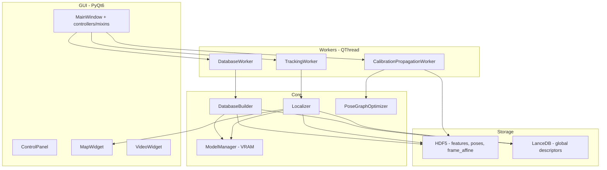
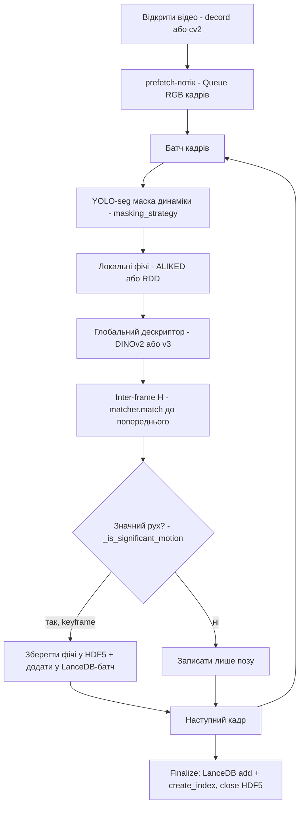
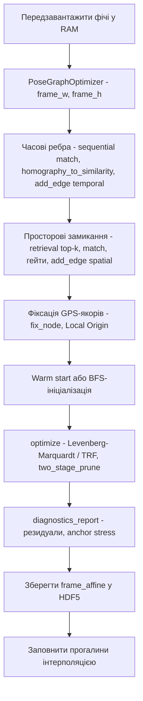
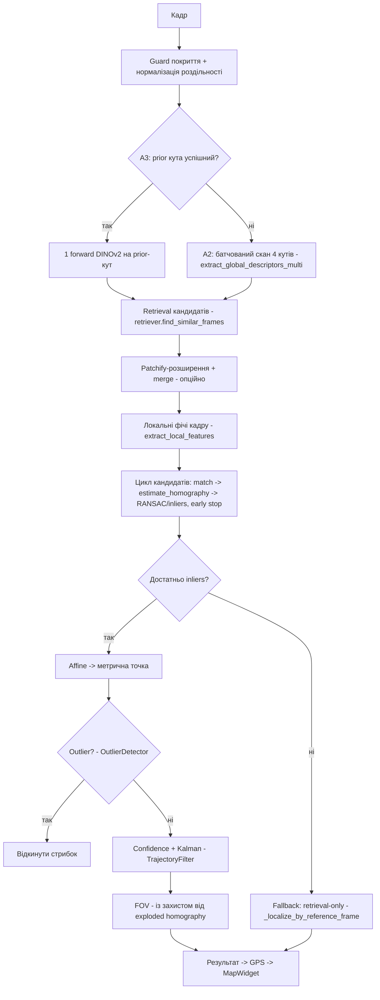
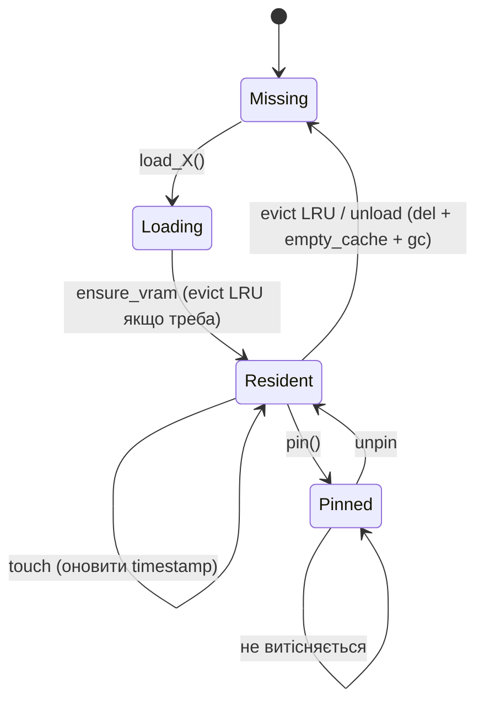

# Архітектура DroneLocalization

Топометрична локалізація дрона за відео: будуємо базу кадрів із карти-відео,
калібруємо її під GPS кількома якорями, потім локалізуємо live-кадри відносно бази
й проєктуємо в GPS. Три незалежні потоки — **build**, **calibration**,
**localization** — плюс менеджер моделей (VRAM) під ними.

---

## Компоненти

---

## Потік 1 — Побудова бази (build)

`DatabaseBuilder.build_from_video` (`src/database/database_builder.py`).

Ключове: **поза пишеться ЗАВЖДИ**, keyframe (з фічами) — вибірково за рухом; глибина
(Depth-Anything) рахується раз на `depth_every_n` кадрів (масштаб змінюється повільно).

---

## Потік 2 — Калібрувальна пропагація (calibration)

`CalibrationPropagationWorker.run` (`src/workers/calibration_propagation_worker.py`)
→ будує й розв'язує 5-DoF pose graph (див. `POSE_GRAPH_MATH.md`).

Прогрес транслюється в GUI через Qt-сигнали (`progress`, `completed`, `error`).
Гейти ребер (`edge_gate_*`) і two-stage prune — за прапорцями конфігу
(`GraphOptimizationConfig`), дефолти off = поточна поведінка.

---

## Потік 3 — Локалізація (localization)

`Localizer.localize_frame` (`src/localization/localizer.py`).

Мультиджерельний режим (`db_manager`, `calib_manager`) перемикає активну базу/калібрування
під час скану кандидатів. `localize_optical_flow` — легкий шлях між keyframe-ами.

---

## Модулі

| Пакет | Відповідальність |
|---|---|
| `config/` | Pydantic-конфіг по доменах: `models`, `database`, `localization`, `graph`, `app`, `access` |
| `src/interfaces.py` | Structural Protocols: `Retriever`, `GlobalDescriptorExtractor`, `LocalFeatureExtractor`, `FrameDatabase` |
| `src/database/` | `DatabaseBuilder`, `DatabaseLoader`, multi-db manager, spatial index |
| `src/localization/` | `Localizer`, `matcher` (retrieval + LightGlue), `patchify`, geo-aware retriever |
| `src/geometry/` | `pose_graph/` (5-DoF LM), `coordinates` (UTM/WebMercator), `affine_utils`, `gsd_calculator`, `transformations` |
| `src/models/` | `ModelManager` (VRAM), `wrappers/` (DINOv2/v3, ALIKED, RDD, YOLO, LightGlue, masking, CESP) |
| `src/calibration/` | multi-anchor calibration, multi-calibration manager |
| `src/tracking/` | Kalman `TrajectoryFilter`, `OutlierDetector`, object tracker/projector |
| `src/workers/` | QThread-обгортки: database, calibration propagation, tracking, panorama, video decode |
| `src/gui/` | `MainWindow`, mixins/controllers, widgets (map/video/control), dialogs |
| `src/network/` | REST + WebSocket сервери телеметрії, coordinates broker |
| `src/depth/`, `src/utils/`, `src/video/` | глибина, утиліти (I/O, логи, нормалізація, телеметрія), джерела відео |

---

## Життєвий цикл моделей (VRAM)

`ModelManager` (`src/models/model_manager.py`) — LRU-реєстр із бюджетом VRAM,
евікшном і pinning'ом. Моделі великі (DINOv2 ~1.6GB, LightGlue ~0.8GB), тож на 8GB-картах
одночасно тримається лише потрібний набір.

Ризики витоків (див. `IMPROVEMENT_PLAN.md` п.5.3): `torch.compile` inductor-кеші,
ONNX Runtime сесії LightGlue, цикли посилань у воркерах — воркери мають брати моделі на
час задачі й занулювати у `finally`.

---

## Посилання

- Математика графа: `docs/POSE_GRAPH_MATH.md`
- План рефакторингу: `docs/IMPROVEMENT_PLAN.md`
- Потоки: `database_builder.py`, `calibration_propagation_worker.py`, `localizer.py`
