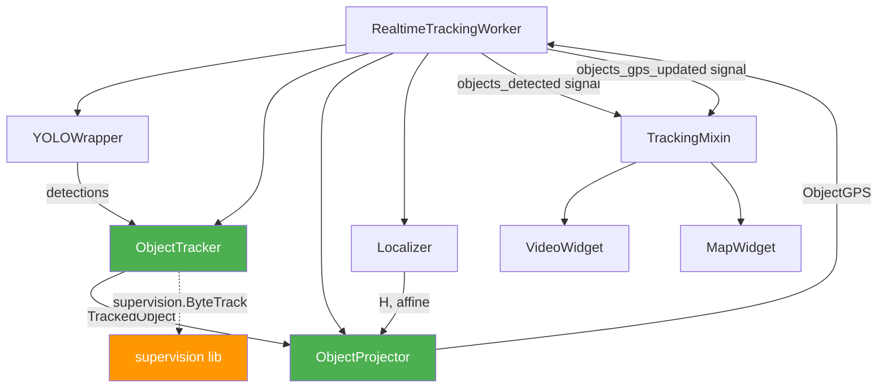

# План імплементації: Трекінг об'єктів на вхідному відео

> **Версія:** 1.0  
> **Дата:** 2026-04-23  
> **Статус:** Пропозиція

---

## 1. Мета

Реалізувати функціонал **виявлення та відстеження рухомих об'єктів** (люди, транспорт, тощо) на вхідному відео під час фази відстеження (`RealtimeTrackingWorker`). Система повинна:

1. Детектувати об'єкти на кожному кадрі за допомогою наявної моделі YOLO11-seg.
2. Присвоювати кожному об'єкту унікальний ID та відстежувати його між кадрами.
3. Проєктувати позицію об'єктів у GPS-координати (використовуючи наявну калібровку).
4. Візуалізувати bounding boxes + ID на відеовіджеті та маркери на карті.
5. Експортувати траєкторії об'єктів разом із результатами локалізації дрона.

---

## 2. Поточний стан системи

### Що вже є

| Компонент | Файл | Опис |
|---|---|---|
| YOLO11-seg | `src/models/wrappers/yolo_wrapper.py` | Детекція + сегментація. Зараз використовується **тільки** для створення `static_mask` (маскування динамічних об'єктів). Повертає `detections: list[dict]` з `class_id`, `confidence`, `bbox`. |
| ModelManager | `src/models/model_manager.py` | Завантаження YOLO з підтримкою TensorRT FP16. |
| TrackingWorker | `src/workers/tracking_worker.py` | Основний цикл обробки відео. Викликає `yolo_wrapper.detect_and_mask()` на ключових кадрах, але **ігнорує** повернені `detections`. |
| VideoWidget | `src/gui/widgets/video_widget.py` | Відображення кадрів через `QGraphicsView`. Має `draw_numbered_point()` для overlay. |
| MapWidget | `src/gui/widgets/map_widget.py` | Leaflet карта з маркерами, траєкторією, FOV. |
| Localizer | `src/localization/localizer.py` | Геотрансформація: Query px → Reference px → Metric → GPS. Зберігає `_last_state` з `H` (Homography) та `affine`. |

### Що відсутнє

- **Трекер об'єктів** — механізм асоціації детекцій між кадрами (Re-ID).
- **Проєкція об'єктів у GPS** — конвеєр pixel → geo для довільних точок кадру.
- **Оверлей на відео** — малювання bounding boxes з ID на `VideoWidget`.
- **Маркери об'єктів на карті** — динамічні маркери на `MapWidget`.
- **Сигнали та слоти** — передача даних про об'єкти з Worker → GUI.
- **Конфігурація** — параметри трекінгу об'єктів.

---

## 3. Архітектурні рішення

### 3.1 Вибір алгоритму трекінгу

| Алгоритм | Плюси | Мінуси | Рекомендація |
|---|---|---|---|
| **ByteTrack** | SOTA якість, чисто CPU, немає додаткової моделі | Потребує зовнішню бібліотеку | ✅ **Основний** |
| **BoT-SORT** | Кращий Re-ID через appearance | Потребує окрему Re-ID модель, більше VRAM | Опціонально |
| SORT (vanilla) | Простий, швидкий | Часті ID-switch | Ні |
| DeepSORT | Стабільний Re-ID | Старий, повільний | Ні |
| Ultralytics built-in tracker | Вбудований у YOLO | Менш гнучкий | Ні |

**Рішення:** Використати **ByteTrack** через бібліотеку [`supervision`](https://github.com/roboflow/supervision), яка надає:
- `sv.ByteTrack` — трекер з мінімальним оверхедом.
- `sv.Detections` — уніфікована структура даних для детекцій.
- `sv.BoxAnnotator`, `sv.LabelAnnotator` — рендеринг bounding boxes.
- Не потребує додаткової GPU-моделі (працює тільки на CPU за Kalman + Hungarian).

### 3.2 Архітектура обробки

```
RealtimeTrackingWorker.run()
    │
    ├── Кожен кадр: frame_ready → VideoWidget
    │
    ├── Ключовий кадр (кожен N-й):
    │   ├── YOLO detect_and_mask() → (static_mask, detections)
    │   ├── ObjectTracker.update(detections, frame) → tracked_objects
    │   ├── Localizer.localize_frame() → drone GPS
    │   └── ObjectProjector.project_to_gps(tracked_objects, H, affine) → objects_gps
    │
    ├── Міжкадр (Optical Flow):
    │   ├── ObjectTracker.predict() → predicted positions (Kalman-only)
    │   └── Localizer.localize_optical_flow() → drone GPS (OF)
    │
    └── Emit signals:
        ├── objects_detected(list[TrackedObject]) → GUI overlay
        └── objects_gps_updated(list[ObjectGPS]) → Map markers
```

### 3.3 Частота детекції об'єктів

YOLO вже запускається на ключових кадрах (`keyframe_interval`, за замовч. 5). Детекція об'єктів буде прив'язана до тих самих ключових кадрів — **без додаткового GPU-навантаження**, оскільки `detect_and_mask()` вже повертає `detections`.

На міжкадрах (OF) трекер використає **предикцію Калмана** для інтерполяції позицій без нового виклику YOLO.

---

## 4. Структура нових/змінених файлів

### 4.1 Нові файли

#### `src/tracking/object_tracker.py` — Ядро трекінгу об'єктів

```python
@dataclass
class TrackedObject:
    track_id: int           # Унікальний ID об'єкта
    class_id: int           # COCO class ID (0=person, 2=car, ...)
    class_name: str         # Людиночитабельна назва класу
    bbox: tuple[float, float, float, float]  # (x1, y1, x2, y2) в пікселях кадру
    confidence: float       # Впевненість детекції
    center_px: tuple[float, float]  # Центр bbox у пікселях

@dataclass
class ObjectGPS:
    track_id: int
    class_name: str
    lat: float
    lon: float
    confidence: float

class ObjectTracker:
    """Обгортка над ByteTrack для трекінгу об'єктів між кадрами."""
    
    def __init__(self, config: dict):
        self.tracker = sv.ByteTrack(
            track_activation_threshold=...,
            lost_track_buffer=...,
            minimum_matching_threshold=...,
            frame_rate=...,
        )
        self._class_names = {0: "person", 1: "bicycle", 2: "car", ...}
    
    def update(self, detections: list[dict], frame_shape: tuple) -> list[TrackedObject]:
        """Оновити трекер новими детекціями. Повертає список відстежених об'єктів."""
    
    def reset(self):
        """Скинути стан трекера (при новій сесії)."""
```

#### `src/tracking/object_projector.py` — Проєкція об'єктів у GPS

```python
class ObjectProjector:
    """Проєктує піксельні координати об'єктів у GPS через наявні H та affine матриці."""
    
    def __init__(self, calibration):
        self.calibration = calibration
    
    def project_objects(
        self,
        objects: list[TrackedObject],
        H: np.ndarray,          # Homography query→ref
        affine: np.ndarray,     # Affine ref→metric
        rotation_angle: int,    # Кут обертання кадру (0/90/180/270)
    ) -> list[ObjectGPS]:
        """Трансформує центри bbox: Query px → Ref px (H) → Metric (Affine) → GPS."""
```

### 4.2 Змінені файли

#### `src/workers/tracking_worker.py`

- Додати нові сигнали: `objects_detected`, `objects_gps_updated`.
- Інтегрувати `ObjectTracker` та `ObjectProjector` у main loop.
- На ключових кадрах: передати існуючі `detections` з `yolo_wrapper` в трекер.
- На OF-кадрах: використати `tracker.predict()` для інтерполяції.

#### `src/gui/widgets/video_widget.py`

- Додати метод `draw_tracked_objects(objects: list[TrackedObject])` для рендерингу bbox + ID.
- Використати кольори на основі `class_id` для візуального розрізнення категорій.

#### `src/gui/widgets/map_widget.py` + `map_template.html`

- Додати сигнал `updateObjectMarkersSignal` у `MapBridge`.
- JavaScript: рендерити маркери об'єктів окремим шаром (layer group) з можливістю toggle.
- Маркери мають відрізнятися від маркера дрона (інший колір/іконка).

#### `src/gui/mixins/tracking_mixin.py`

- Підключити нові сигнали: `objects_detected` → `on_objects_detected()`, `objects_gps_updated` → `on_objects_gps_updated()`.
- Зберігати історію об'єктів для експорту.

#### `config/config.py`

- Додати `ObjectTrackingConfig` у `AppConfig`:
  ```python
  class ObjectTrackingConfig(BaseModel):
      enabled: bool = True
      track_activation_threshold: float = 0.25
      lost_track_buffer: int = 30
      minimum_matching_threshold: float = 0.8
      tracked_classes: list[int] = [0, 1, 2, 3, 5, 7]  # COCO classes
      show_on_video: bool = True
      show_on_map: bool = True
      project_to_gps: bool = True
  ```

#### `src/core/export_results.py`

- Додати експорт траєкторій об'єктів у CSV/GeoJSON.

---

## 5. Поетапний план імплементації

### Фаза 1: Ядро трекера (без GUI)

| # | Задача | Файл |
|---|---|---|
| 1.1 | Додати `supervision` у `pyproject.toml` | `pyproject.toml` |
| 1.2 | Створити `ObjectTracker` з ByteTrack | `src/tracking/object_tracker.py` |
| 1.3 | Створити `ObjectProjector` | `src/tracking/object_projector.py` |
| 1.4 | Додати `ObjectTrackingConfig` | `config/config.py` |
| 1.5 | Unit-тести для `ObjectTracker` | `tests/test_object_tracker.py` |

### Фаза 2: Інтеграція у TrackingWorker

| # | Задача | Файл |
|---|---|---|
| 2.1 | Додати сигнали `objects_detected`, `objects_gps_updated` | `tracking_worker.py` |
| 2.2 | Створити `ObjectTracker` + `ObjectProjector` у `run()` | `tracking_worker.py` |
| 2.3 | Обробляти `detections` з `yolo_wrapper` на ключових кадрах | `tracking_worker.py` |
| 2.4 | GPS-проєкція через `_last_state["H"]` та `_last_state["affine"]` | `tracking_worker.py` |
| 2.5 | Інтерполяція на OF-кадрах (Kalman predict) | `tracking_worker.py` |

### Фаза 3: Візуалізація

| # | Задача | Файл |
|---|---|---|
| 3.1 | `draw_tracked_objects()` у VideoWidget | `video_widget.py` |
| 3.2 | Сигнали в MapBridge для маркерів об'єктів | `map_widget.py` |
| 3.3 | JavaScript шар для об'єктів у map_template | `map_template.html` |
| 3.4 | Підключити сигнали у TrackingMixin | `tracking_mixin.py` |

### Фаза 4: Експорт та UI

| # | Задача | Файл |
|---|---|---|
| 4.1 | Збереження історії об'єктів у `_tracking_results` | `tracking_mixin.py` |
| 4.2 | Експорт траєкторій об'єктів у CSV/GeoJSON | `export_results.py` |
| 4.3 | Toggle кнопка "Показати/Сховати об'єкти" у ControlPanel | `control_panel.py` |

---

## 6. Детальний опис ключових компонентів

### 6.1 Потік даних на ключовому кадрі

```
frame_rgb
    │
    ▼
YOLOWrapper.detect_and_mask(frame_rgb)
    │
    ├── static_mask → Localizer.localize_frame()
    │                     │
    │                     ▼
    │                 _last_state = {H, affine, candidate_id, ...}
    │                 location_found.emit(lat, lon, conf, inliers)
    │
    └── detections → ObjectTracker.update(detections, frame.shape)
                          │
                          ▼
                      tracked_objects: list[TrackedObject]
                          │
                          ├── objects_detected.emit(tracked_objects)
                          │       → VideoWidget.draw_tracked_objects()
                          │
                          └── ObjectProjector.project_objects(
                                  tracked_objects,
                                  _last_state["H"],
                                  _last_state["affine"],
                                  _last_state["global_angle"]
                              )
                              │
                              ▼
                          objects_gps: list[ObjectGPS]
                              │
                              └── objects_gps_updated.emit(objects_gps)
                                      → MapWidget.update_object_markers()
```

### 6.2 GPS-проєкція об'єкта (ObjectProjector)

Використовує **ту саму трансформацію**, що й `Localizer`, але для довільної точки кадру:

```python
def project_single_point(self, px_x, px_y, H, affine, angle):
    # 1. Враховуємо обертання кадру (якщо angle != 0)
    rotated_pt = self._apply_rotation(px_x, px_y, angle, frame_w, frame_h)
    
    # 2. Query pixels → Reference pixels (Homography)
    pt_query = np.array([[rotated_pt]], dtype=np.float64)
    pt_ref = GeometryTransforms.apply_homography(pt_query, H)
    
    # 3. Reference pixels → Metric (Affine calibration)
    pt_metric = GeometryTransforms.apply_affine(pt_ref, affine)
    
    # 4. Metric → GPS (WGS84)
    lat, lon = self.calibration.converter.metric_to_gps(pt_metric[0, 0], pt_metric[0, 1])
    return lat, lon
```

### 6.3 Обробка на OF-кадрах

На кадрах між ключовими (Optical Flow) YOLO **не запускається**. Є два варіанти:

**Варіант A (рекомендований):** Залишити останні відомі bbox без оновлення. Трекер ByteTrack має вбудований Kalman-предиктор, який зсуває bbox відповідно до оціненої швидкості об'єкта.

**Варіант B:** Використати OF-вектори (`dx_px, dy_px`) для зсуву bbox. Це дає приблизну корекцію, але OF-вектор відображає рух **камери**, а не об'єкта.

### 6.4 Рендеринг на VideoWidget

```python
def draw_tracked_objects(self, objects: list[TrackedObject]):
    """Малює bounding boxes з track_id та class_name на поточному кадрі."""
    self.clear_object_overlays()
    
    COLOR_MAP = {
        0: QColor(255, 100, 100),   # person — червоний
        2: QColor(100, 200, 255),   # car — блакитний
        3: QColor(255, 200, 50),    # motorcycle — жовтий
        # ...
    }
    
    for obj in objects:
        color = COLOR_MAP.get(obj.class_id, QColor(200, 200, 200))
        # Малюємо прямокутник bbox
        rect = self._scene.addRect(
            obj.bbox[0], obj.bbox[1],
            obj.bbox[2] - obj.bbox[0],
            obj.bbox[3] - obj.bbox[1],
            QPen(color, 2)
        )
        # Підпис: "ID #5 car 0.92"
        label = f"#{obj.track_id} {obj.class_name} {obj.confidence:.0%}"
        text = self._scene.addText(label)
        text.setPos(obj.bbox[0], obj.bbox[1] - 20)
```

---

## 7. Нові сигнали (Qt)

| Сигнал | Джерело | Споживач | Дані |
|---|---|---|---|
| `objects_detected` | `RealtimeTrackingWorker` | `TrackingMixin` → `VideoWidget` | `list` (серіалізований як JSON через pickle або QVariant) |
| `objects_gps_updated` | `RealtimeTrackingWorker` | `TrackingMixin` → `MapWidget` | `list` (серіалізований) |

> **Увага:** PyQt6 сигнали не підтримують передачу довільних Python-об'єктів напряму. Використовуємо `pyqtSignal(object)` або серіалізацію в `list[dict]`.

---

## 8. Залежності

| Пакет | Версія | Призначення | Розмір |
|---|---|---|---|
| `supervision` | `>=0.22.0` | ByteTrack, Detections, Annotators | ~5 MB |

> `supervision` — єдина нова залежність. Не потребує GPU, працює на чистому NumPy/SciPy.

---

## 9. Конфігурація

```yaml
# Нова секція в AppConfig
object_tracking:
  enabled: true                      # Вмикає/вимикає трекінг об'єктів
  track_activation_threshold: 0.25   # Мін. confidence для початку треку
  lost_track_buffer: 30              # Кількість кадрів без детекції до видалення треку
  minimum_matching_threshold: 0.8    # IoU поріг для асоціації
  tracked_classes: [0, 1, 2, 3, 5, 7]  # COCO: person, bicycle, car, motorcycle, bus, truck
  show_on_video: true                # Показувати bbox на відео
  show_on_map: true                  # Показувати маркери на карті
  project_to_gps: true               # Проєктувати координати в GPS
```

---

## 10. Оцінка продуктивності

| Операція | Час (на кадр) | Примітка |
|---|---|---|
| YOLO detect_and_mask | ~8 мс (TRT FP16) | **Вже виконується** — додатковий оверхед = 0 |
| ByteTrack update | ~0.5 мс | Тільки CPU, Kalman + Hungarian |
| GPS-проєкція (N об'єктів) | ~0.1 мс | Матричне множення (batch) |
| Рендеринг bbox (Qt) | ~1 мс | Залежить від кількості об'єктів |
| **Загальний додатковий оверхед** | **~1.6 мс** | Менше 5% від поточного часу обробки |

---

## 11. Обмеження та ризики

| Ризик | Вплив | Мітігація |
|---|---|---|
| GPS-точність для об'єктів на краях кадру | Homography може спотворювати краї | Обмежити проєкцію зоною inliers або центральною частиною кадру |
| ID-switch при перекритті об'єктів | Тимчасова втрата треку | ByteTrack добре справляється; за потреби перейти на BoT-SORT |
| Відсутність детекцій на OF-кадрах | Затримка оновлення позицій на `keyframe_interval` кадрів | Kalman prediction у ByteTrack компенсує; можна зменшити `keyframe_interval` |
| Серіалізація Python-об'єктів через Qt-сигнали | Потенційні проблеми з потоками | Використати `pyqtSignal(object)` або серіалізацію в `list[dict]` |

---

## 12. Верифікація

### Автоматичні тести

```bash
# Unit-тести для ObjectTracker (без GPU)
pytest tests/test_object_tracker.py -v

# Unit-тести для ObjectProjector (мокнуті H та affine)
pytest tests/test_object_projector.py -v
```

### Ручна верифікація

1. Запустити трекінг на тестовому відео з відомими об'єктами.
2. Перевірити стабільність ID (без частих switch).
3. Перевірити що GPS-координати об'єктів відповідають їхнім реальним позиціям на карті.
4. Перевірити що bbox коректно відображаються на відеовіджеті.
5. Перевірити експорт — наявність траєкторій об'єктів у CSV/GeoJSON.

---

## 13. Діаграма залежностей модулів



> 🟢 Зелений — нові компоненти  
> 🟠 Оранжевий — нова залежність
