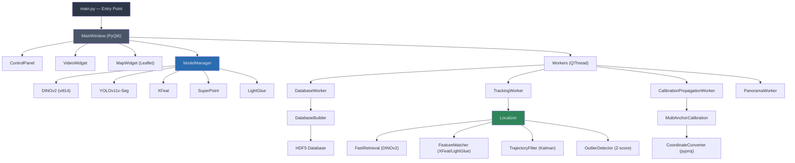
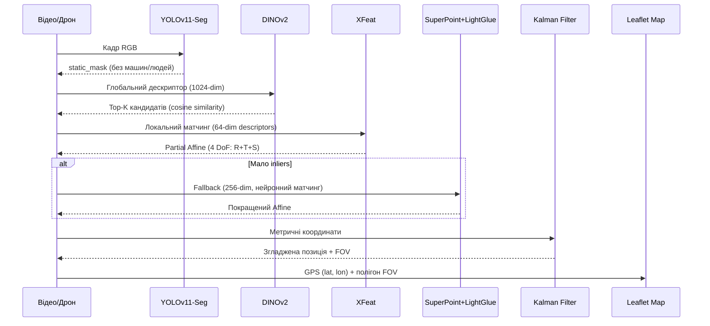
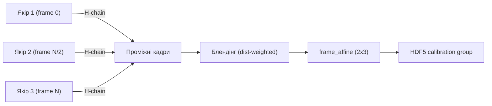

# Аналіз проєкту Drone Topometric Localization System

## Загальний огляд

Професійна десктопна система топометричної локалізації дронів у середовищах без GPS. Побудована на **PyQt6**, використовує стек нейронних мереж: **DINOv2** (глобальний пошук), **YOLOv11-Seg** (фільтрація динамічних об'єктів), **XFeat** (швидкий матчинг ознак) та **SuperPoint + LightGlue** (fallback для складних сцен). Дані зберігаються в **HDF5**, координати обробляються через **pyproj** (Web Mercator / UTM), траєкторія згладжується **Kalman Filter** з детекцією аномалій через **Z-score**.

> [!IMPORTANT]
> Версія 1.0.0, Python 3.11, PyTorch 2.2.0 + CUDA 12.1, Windows 10/11

---

## Архітектура



---

## Структура пакетів

| Пакет | Файли | Опис |
|-------|-------|------|
| `src/gui/` | `main_window.py`, `widgets/`, `dialogs/`, `mixins/` | PyQt6 GUI: вікно, карта, відео, панель управління |
| `src/models/` | `model_manager.py`, `wrappers/` | Централізоване VRAM-управління моделями, wrappers (FeatureExtractor, YOLOWrapper) |
| `src/database/` | `database_builder.py`, `database_loader.py` | Побудова та лінивий доступ до HDF5 бази ознак |
| `src/localization/` | `localizer.py`, `matcher.py` | Основний пайплайн: глобальний пошук → локальний матчинг → координатна проекція |
| `src/geometry/` | `coordinates.py`, `transformations.py` | WGS84↔Metric конверсія, Homography/Affine/PartialAffine з валідацією |
| `src/calibration/` | `multi_anchor_calibration.py` | Мульти-якірне GPS-калібрування з QA-метриками |
| `src/tracking/` | `kalman_filter.py`, `outlier_detector.py` | Фільтрація траєкторії (filterpy), детекція аномальних стрибків |
| `src/workers/` | 5 QThread-воркерів | Фонові потоки: трекінг, БД, пропагація, панорами |
| `src/core/` | `project.py`, `project_registry.py`, `export_results.py` | Проєктний менеджмент та експорт результатів |
| `src/utils/` | `logging_utils.py`, `image_preprocessor.py`, `image_utils.py` | Loguru логування, CLAHE препроцесинг |
| `config/` | `config.py` | Єдиний Python-конфіг (словник `APP_CONFIG`) |

---

## Пайплайн локалізації



### Алгоритм `localize_frame()` (крок за кроком)

1. **Auto-rotation**: Перебір 0°/90°/180°/270° — DINOv2 глобальний скор визначає найкращий ракурс
2. **Global retrieval**: Top-K кандидатів з HDF5 бази за косинусною схожістю (norms precomputed)
3. **Local matching**: XFeat detectAndCompute → BFMatcher (Lowe's ratio + MNN) → RANSAC Partial Affine (4 DoF)
4. **LightGlue fallback**: Якщо XFeat inliers < `min_inliers_accept` (10) — SuperPoint + LightGlue
5. **Coordinate projection**: Query center → Affine → Reference → Affine_ref → Metric → GPS
6. **Outlier filter**: Z-score + max_speed check (auto-reset після 5 consecutive outliers)
7. **Kalman smoothing**: 4D state `[x, y, vx, vy]`, adaptive dt
8. **FOV calculation**: 4 кути кадру проектуються через ланцюг трансформацій → GPS полігон

---

## GPS-калібрування та пропагація



- **Wave propagation**: Від кожного якоря будується ланцюг гомографій `H(frame_i → anchor)`
- **Between-anchors blending**: Лінійна інтерполяція за відстанню до лівого/правого якоря
- **QA метрики**: RMSE, disagreement (розбіжність між гілками), кількість inliers
- **Projection persistence**: JSON з типом проекції (UTM/WebMercator) зберігається в HDF5

---

## Моделі та VRAM

| Модель | Розмір | VRAM | Призначення |
|--------|--------|------|-------------|
| DINOv2 (vitl14) | ~1.2 GB | 1600 MB | Глобальні дескриптори (1024-dim) |
| YOLOv11x-Seg | ~125 MB | 1200 MB | Сегментація динамічних об'єктів |
| XFeat | ~20 MB | 300 MB | Локальні ознаки (64-dim, 2048 keypoints) |
| SuperPoint | ~25 MB | 500 MB | Fallback ознаки (256-dim, 4096 keypoints) |
| LightGlue | ~50 MB | 1000 MB | Нейронний матчер для SuperPoint |

`ModelManager` автоматично вивантажує найменш використану модель при дефіциті VRAM (LRU eviction).

---

## HDF5 структура бази даних

```
database.h5
├── global_descriptors/
│   ├── descriptors    (N, 1024) float32  — DINOv2 глобальні дескриптори
│   └── frame_poses    (N, 3, 3) float64  — Накопичені гомографії H(frame_i→frame_0)
├── local_features/
│   └── frame_<id>/
│       ├── keypoints   (K, 2) float32    — XFeat координати
│       ├── descriptors (K, 64) float32   — XFeat дескриптори
│       └── coords_2d   (K, 2) float32    — 2D координати
├── calibration/        (після пропагації)
│   ├── frame_affine   (N, 2, 3) float32  — Метричні афінні матриці
│   ├── frame_valid    (N,) uint8         — Валідність кадру
│   ├── frame_rmse     (N,) float32       — RMSE метрика
│   ├── frame_disagreement (N,) float32   — Розбіжність між якорями
│   └── frame_matches  (N,) int32         — Кількість inliers
└── metadata/
    └── attrs: num_frames, frame_width, frame_height, descriptor_dim
```

---

## Оптимізації продуктивності

- **FP16 mixed precision** для DINOv2 та XFeat (~1.5-2x прискорення на GPU)
- **Threaded video prefetch** — CPU декодує наступний кадр поки GPU обробляє поточний
- **cuDNN benchmark** увімкнений для стабільних розмірів input
- **Vectorized YOLO masking** — одне об'єднання всіх динамічних масок замість попіксельної ітерації
- **argpartition O(n)** замість argsort O(n log n) для ratio test у матчері
- **LRU кеш** для `get_local_features()` та `get_frame_size()` у DatabaseLoader
- **Adaptive top_k** для XFeat — масштабується за площею зображення

---

## Тестування

| Файл | Покриття |
|------|----------|
| [test_geometry_utils.py](file:///e:/Dip/gsdfg/New/DroneLocalization/tests/test_geometry_utils.py) | Валідація матриць, Affine/Homography |
| [test_coordinates_modes.py](file:///e:/Dip/gsdfg/New/DroneLocalization/tests/test_coordinates_modes.py) | WGS84↔Metric, UTM/WebMercator |
| [test_projections.py](file:///e:/Dip/gsdfg/New/DroneLocalization/tests/test_projections.py) | Проекційні перетворення |
| [test_config_defaults.py](file:///e:/Dip/gsdfg/New/DroneLocalization/tests/test_config_defaults.py) | Дефолтні значення конфігу |
| `tests/unit/` | Юніт-тести |
| `tests/integration/` | Інтеграційні тести |

---

## Інструменти збірки

- **ruff** — лінтер + форматер (line-length=100, target py311)
- **ty** — опціональний тайп-чекер
- **pytest** + pytest-cov + pytest-qt — тестування
- **PyInstaller** — `scripts/build_executable.py` → `DroneLocalization.exe`
- **Inno Setup** — `create_installer.iss` → Windows інсталятор

---

## Потенційні точки поліпшення

> [!NOTE]
> Ці пункти виявлені під час аналізу коду. Вони не є помилками, а можливостями для подальшого розвитку.

1. **`feature_extractor.py:86-87`** — Порожній `with` блок (`pass`) як fallback для FP16 при portrait-зображеннях. Цей код виконується, але нічого не робить — мертвий блок
2. **`yolo_wrapper.py:76-78`** — Логгер створюється всередині циклу (`get_logger(__name__)` при кожному over-masking), хоча це не критично через кешування loguru
3. **`config.py`** — Конфіг як Python dict — працює, але не підтримує hot-reload чи per-environment override (OmegaConf є в залежностях, але не використовується)
4. **`database_builder.py`** — Гомографії між кадрами рахуються через BFMatcher, а не через XFeat вбудований матчер — потенційно менш точно
5. **`localizer.py:214-217`** — Fallback `update` vs `update_with_dt` через `hasattr` — legacy сумісність
