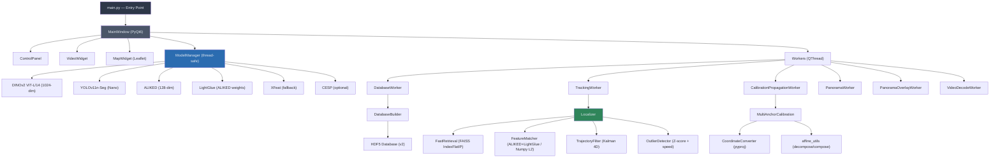
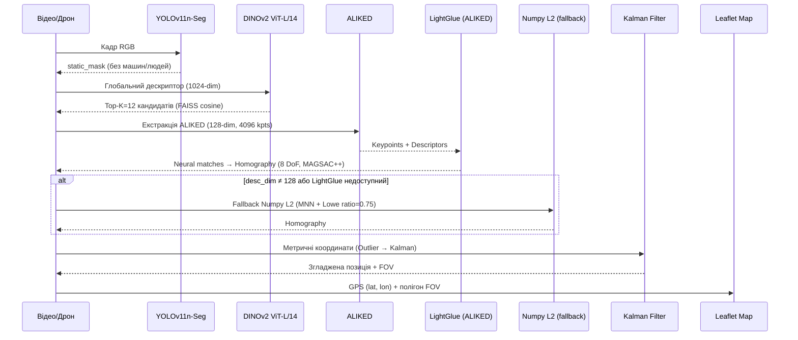
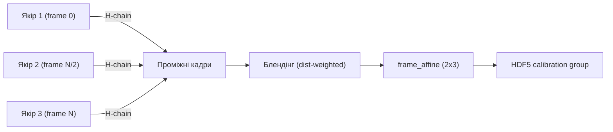

# Аналіз проєкту — Drone Topometric Localization System

> **Дата аналізу:** 2026-04-10
> **Версія проєкту:** 1.0.0
> **Ліцензія:** MIT

---

## 1. Загальна характеристика

**Drone Topometric Localization System** — десктопний застосунок для визначення GPS-координат дрона без GNSS-приймача, використовуючи візуальний пайплайн на основі deep learning.

| Метрика | Значення |
|---------|----------|
| Мова | Python 3.11 |
| Файлів у `src/` | 56 (`.py`) |
| Рядків коду (src) | ~8 000 |
| Тестових файлів | 23 |
| Залежностей (runtime) | 20 |
| Моделі NN | 6 (ALIKED, DINOv2, LightGlue, YOLO, SuperPoint, CESP) |
| GUI | PyQt6 + PyQt6-WebEngine (Leaflet карта) |
| База даних | HDF5 v2 (pre-allocated, LZF, float16) |

> [!IMPORTANT]
> Python 3.11, PyTorch 2.2.0 + CUDA 12.1, Windows 10/11

---

## 2. Архітектура

### 2.1 Модульна структура

```
src/
 ├── calibration/       # GPS-калібрування (мульти-якір, PCHIP)
 ├── core/              # Проєктний менеджер, експорт результатів
 ├── database/          # HDF5 Builder + Loader
 ├── geometry/          # Transformations, Coordinates, Affine utils, PoseGraphOptimizer
 ├── gui/               # PyQt6: MainWindow + Mixins + Widgets + Dialogs
 ├── localization/      # Localizer + Matcher (FAISS + LightGlue)
 ├── models/            # ModelManager + Wrappers (6 моделей)
 ├── tracking/          # Kalman Filter + Outlier Detector
 ├── utils/             # Logging, image utils, telemetry
 └── workers/           # 6 QThread-воркерів
```

GUI від'єднане від бізнес-логіки через **mixins** (`DatabaseMixin`, `CalibrationMixin`, `TrackingMixin`, `PanoramaMixin`) і **QThread workers**.

### 2.2 Граф залежностей



### 2.3 Конфігурація (Pydantic v2)

Вся конфігурація зосереджена у `config/config.py` через ієрархію типобезпечних Pydantic-моделей:

```
AppConfig
 ├── Dinov2Config           # descriptor_dim=1024, input_size=336
 ├── DatabaseConfig         # frame_step, compression, keyframe thresholds
 ├── LocalizationConfig     # min_matches, retrieval_top_k, auto_rotation
 │   └── ConfidenceConfig   # inlier/stability weights
 ├── TrackingConfig         # kalman_process_noise, outlier_window, max_speed
 ├── PreprocessingConfig    # CLAHE, masking_strategy
 ├── GuiConfig              # video_fps, display modes
 ├── ModelsConfig           # use_cuda, per-model configs
 │   ├── YoloConfig         # model_path, vram_required_mb
 │   ├── ModelSettings      # hub_repo, max_keypoints, etc.
 │   ├── CespConfig         # enabled, weights_path
 │   ├── VramManagementConfig
 │   ├── PerformanceConfig  # fp16, torch_compile, debug_mode
 │   └── ModelsCacheConfig  # engine_cache_dir
 ├── ProjectionConfig       # WEB_MERCATOR/UTM, RMSE thresholds
 ├── HomographyConfig       # backend (opencv/poselib), ransac params
 └── GraphOptimizationConfig # loop closure, LM optimizer params
```

Доступ через `get_cfg(config, "section.key", default)` — підтримує як dict, так і Pydantic-об'єкти.

---

## 3. Структура пакетів

| Пакет | Ключові файли | Опис |
|-------|--------------|------|
| `src/gui/` | `main_window.py`, `widgets/`, `dialogs/`, `mixins/` | PyQt6 GUI: вікно, Leaflet карта, відео віджет, панель управління |
| `src/models/` | `model_manager.py`, `wrappers/` | Thread-safe VRAM-управління (`threading.Lock`), wrappers: FeatureExtractor, YOLOWrapper, ALIKED, TRT DINOv2, CESP, MaskingStrategy |
| `src/database/` | `database_builder.py`, `database_loader.py` | Побудова HDF5 v2 (pre-allocated arrays) та лінивий доступ з LRU-кешем |
| `src/localization/` | `localizer.py`, `matcher.py` | Пайплайн: DINOv2 retrieval → ALIKED+LightGlue matching → MAGSAC++ Homography → координатна проекція |
| `src/geometry/` | `coordinates.py`, `transformations.py`, `affine_utils.py`, `pose_graph_optimizer.py` | WGS84↔Metric конверсія (pyproj), Homography/Affine з валідацією, decompose/compose, графова оптимізація |
| `src/calibration/` | `multi_anchor_calibration.py` | Мульти-якірне GPS-калібрування (PCHIP інтерполяція) з QA-метриками |
| `src/tracking/` | `kalman_filter.py`, `outlier_detector.py` | 4D Kalman `[x,y,vx,vy]` (filterpy), Z-score + speed guard з auto-reset |
| `src/workers/` | 6 QThread-воркерів | DatabaseWorker, TrackingWorker, CalibrationPropagationWorker, PanoramaWorker, PanoramaOverlayWorker, VideoDecodeWorker |
| `src/core/` | `project.py`, `project_registry.py`, `export_results.py` | Проєктний менеджмент, реєстр останніх проєктів, експорт CSV/GeoJSON/KML |
| `src/utils/` | `logging_utils.py`, `image_preprocessor.py`, `image_utils.py`, `telemetry.py` | Loguru логування, CLAHE препроцесинг, OpenCV↔QPixmap конвертери, профайлінг |
| `config/` | `config.py` | Pydantic v2 конфігурація (`AppConfig` + `APP_SETTINGS` + `APP_CONFIG` dict fallback) |

---

## 4. Пайплайн локалізації



### Алгоритм `localize_frame()` (крок за кроком)

1. **Out-of-coverage guard**: Якщо `_consecutive_failures >= max_consecutive_failures` (10) → повертає `"out_of_coverage"` і скидає лічильник
2. **Auto-rotation**: Перебір 0°/90°/180°/270° — DINOv2 глобальний скор визначає найкращий ракурс
3. **Global retrieval**: FAISS IndexFlatIP пошук, Top-K=12 кандидатів за косинусною схожістю
4. **Local matching**: ALIKED (128-dim) → LightGlue neural matching → MAGSAC++ Homography (8 DoF)
5. **Fallback**: Якщо desc_dim ≠ 128 або LightGlue недоступний → Numpy L2 matching з MNN + Lowe's ratio test (0.75)
6. **Early stop**: Якщо ≥40 inliers — решту кандидатів не перевіряємо
7. **Retrieval-only fallback**: Якщо inliers < min_matches і global_score ≥ 0.90 → використовує центр опорного кадру
8. **Coordinate projection**: Query center → Homography → Reference pixel → Affine → Metric → GPS (pyproj)
9. **Outlier filter**: Z-score + max_speed check (auto-reset після 5 consecutive outliers)
10. **Kalman smoothing**: 4D state `[x, y, vx, vy]`, adaptive dt, `reset()` при новій сесії
11. **FOV calculation**: 4 кути кадру → Homography → Affine → Metric → GPS полігон
12. **FOV explosion guard**: Якщо max координата > 50000px → fallback до bounding box inliers

### Optical Flow підтримка

Метод `localize_optical_flow()` дозволяє між-кадрову локалізацію на основі піксельного зсуву (dx, dy), використовуючи збережені матриці від останнього успішного keyframe.

---

## 5. GPS-калібрування та пропагація



- **Wave propagation**: Від кожного якоря будується ланцюг гомографій `H(frame_i → anchor)` через ALIKED+LightGlue
- **Between-anchors blending**: Лінійна інтерполяція за відстанню до лівого/правого якоря
- **PCHIP інтерполяція**: При ≥2 якорях — C¹-гладкий перехід через PchipInterpolator (scipy)
- **Паралельна обробка**: `ThreadPoolExecutor(max_workers=4)` для незалежних сегментів
- **QA метрики**: RMSE, disagreement (розбіжність між гілками), кількість inliers
- **Projection persistence**: JSON з типом проекції (UTM/WebMercator) зберігається в HDF5

---

## 6. Моделі та VRAM

| Модель | Розмір | VRAM | Дескриптор | Призначення |
|--------|--------|------|-----------|-------------|
| DINOv2 ViT-L/14 | ~1.2 GB | 1600 MB | 1024-dim | Глобальний place recognition, підтримує TensorRT FP16 |
| YOLOv11n-Seg | ~6 MB | 200 MB | — | Сегментація динамічних об'єктів (Nano-версія) |
| ALIKED | ~15 MB | 400 MB | 128-dim | Локальні ознаки (до 4096 keypoints) — **основний** |
| LightGlue (ALIKED) | ~50 MB | 1000 MB | — | Нейронний матчер для ALIKED — **основний** |
| XFeat | ~20 MB | 300 MB | 64-dim | Fallback ознаки (2048 keypoints) |
| CESP | ~5 MB | 100 MB | 1024-dim | Покращення DINOv2 дескрипторів (optional) |

### Управління VRAM

`ModelManager` реалізує:
- **Lazy loading** — моделі завантажуються при першому використанні
- **LRU eviction** — при дефіціті VRAM вивантажує найменш використовувану модель
- **Thread-safe** — `threading.Lock` захищає від race conditions (prewarm thread + main thread)
- **Pin mechanism** — критичні моделі можна закріпити в VRAM через `pin(["aliked", "lightglue_aliked"])`
- **TensorRT fallback** — автоматичний TRT → PyTorch fallback для DINOv2 та YOLO
- **torch.compile** — умовна компіляція ALIKED та DINOv2 (потребує Triton на Windows)

---

## 7. HDF5 структура бази даних (v2)

```
database.h5
├── metadata/
│   ├── attrs: num_frames, frame_width, frame_height, fps, hdf5_schema="v2"
│   ├── attrs: actual_num_frames, max_keypoints, descriptor_dim
│   └── frame_index_map   (dataset: int32) — збережені keyframe IDs
│
├── global_descriptors/
│   ├── descriptors        (N × 1024, float32, lzf, chunks=256)
│   └── frame_poses        (N × 3 × 3, float64, lzf) — кумулятивні гомографії
│
├── local_features/
│   ├── attrs: frame_height, frame_width
│   ├── keypoints          (N × max_kps × 2, float32, lzf, chunks=64)
│   ├── descriptors        (N × max_kps × 128, float16, lzf) — 50% менше RAM
│   ├── coords_2d          (N × max_kps × 2, float32, lzf)
│   └── kp_counts          (N, int16) — кількість keypoints на кадр
│
└── calibration/           (створюється після пропагації)
    ├── attrs: version="2.1", num_anchors, anchors_json, projection_json
    ├── frame_affine       (N × 2 × 3, float32, gzip)
    ├── frame_valid        (N, uint8, gzip)
    ├── frame_rmse         (N, float32, gzip)
    ├── frame_disagreement (N, float32, gzip)
    └── frame_matches      (N, int32, gzip)
```

**Оптимізації v2:**
- **Pre-allocated масиви** замість per-frame груп → O(1) запис
- **LZF компресія** — вбудована в h5py, висока швидкість
- **float16 дескриптори** — 50% менший footprint, конвертація в float32 при читанні
- **Chunked I/O** — chunk=64 кадри для послідовного доступу
- **SWMR mode** — підтримка паралельного читання під час запису

---

## 8. Оптимізації продуктивності

- **FP16 mixed precision** для DINOv2 та ALIKED (~1.5-2x прискорення)
- **TensorRT acceleration** для DINOv2 FP16 та YOLO FP16 (~2-3x швидкість)
- **torch.compile** для ALIKED та DINOv2 (inductor/default backend, потребує Triton)
- **Decord video reader** — швидше декодування відео з batch API, fallback на OpenCV
- **Threaded video prefetch** — CPU декодує кадри поки GPU обробляє (Queue, maxsize=32)
- **Daemon prewarm thread** — моделі завантажуються паралельно при старті
- **cuDNN benchmark** — увімкнений для CNN-моделей (ALIKED, XFeat)
- **YOLO micro-batching** — batch по 2 кадри через MaskingStrategy
- **Vectorized YOLO masking** — одне об'єднання масок замість попіксельної ітерації
- **FAISS IndexFlatIP** — мільйонний пошук за ~1мс (Inner Product для нормалізованих векторів)
- **argpartition O(n)** замість argsort O(n log n) для Lowe's ratio test
- **LRU кеш** для `get_local_features()` та `get_frame_size()` у DatabaseLoader
- **Adaptive keyframe selection** — пропуск кадрів без значного руху (min_translation=15px, min_rotation=1.5°)
- **Kalman reset** — скидання стану при новій сесії для точних перших кадрів

---

## 9. Тестування

| Файл | Опис |
|------|------|
| `test_geometry_utils.py` (5.6 KB) | Валідація матриць, Affine/Homography обчислення |
| `test_coordinates.py` + `test_coordinates_modes.py` | WGS84↔Metric, UTM/WebMercator, Haversine |
| `test_projections.py` | Проекційні перетворення |
| `test_config_defaults.py` + `test_config_sync.py` | Дефолтні значення, синхронізація конфігу |
| `test_affine_utils.py` | Decompose/compose афінних матриць |
| `test_localization.py` | Локалізаційний пайплайн |
| `test_pose_graph_optimizer.py` (11 KB) | Детальні тести графової оптимізації |
| `tests/unit/` | Юніт-тести: database, gui, models, calibration, project |
| `tests/integration/` | Інтеграційні тести (pipeline) |
| `tests/benchmarks/` | Бенчмарки продуктивності |

**Інструменти:** pytest + pytest-cov + pytest-qt + pytest-benchmark

---

## 10. Інструменти збірки та CI

- **ruff** — лінтер + форматер (line-length=100, target py311, isort, bugbear, pyupgrade)
- **ty** — опціональний тайп-чекер (Python 3.11)
- **pre-commit** — автоматичні перевірки перед комітом
- **PyInstaller** — `scripts/build_executable.py` → `DroneLocalization.exe`
- **Inno Setup** — `create_installer.iss` → Windows інсталятор

---

## 11. Система логування

Побудована на **loguru** (через `src/utils/logging_utils.py`). Усі модулі використовують `get_logger(__name__)`.

**Принципи:**
- Кожен `except` блок логує **причину** помилки, контекст змінних (shapes, paths, VRAM), та `exc_info=True`
- При старті додатку логуються версії Python, PyTorch, CUDA, GPU name і VRAM
- `DEBUG` — проміжні стани (матриці, candidate IDs); `INFO` — потік; `WARNING`/`ERROR` — проблеми

**Файли логів:**
- `logs/app.log` — текстовий лог (rotation 10 MB, retention 7 days)
- `logs/localization_failures.csv` — структурований журнал невдалих локалізацій

**Телеметрія:**
- `src/utils/telemetry.py` — профайлінг окремих етапів пайплайну (YOLO, retrieval, matching, HDF5 write)

---

## 12. Виявлені проблеми та рекомендації

> [!NOTE]
> Ці пункти виявлені під час аналізу коду. Вони не є помилками, а можливостями для подальшого розвитку.

### Критичні

1. **`yolo11x-seg.pt` (125 MB) в Git** — конфіг переключений на nano, x-seg — мертва вага. Видалити та додати до `.gitignore`
2. **`yolo11n-seg.onnx` (11 MB) в Git** — краще завантажувати через `scripts/download_models.py` або Git LFS

### Помірні

3. **README застарів** — згадує XFeat/384-dim як основний метод, фактично ALIKED/1024-dim; інструкція pip install некоректна
4. **Коментарі-анахронізми** — docstrings у `database_builder.py` ("using XFeat"), легенда відео ("XFeat keypoint"), `matcher.py` ("XFeat or SuperPoint")
5. **`omegaconf` у залежностях** — не використовується, конфігурація на Pydantic
6. **`filterpy`** — бібліотека не підтримується (остання версія 2018), рекомендовано замінити
7. **`poselib` у залежностях** — `HomographyConfig.backend` має поле "poselib", але реальна інтеграція відсутня
8. **Тести-заглушки** — `test_pipeline.py` (151 bytes) та `test_gtsam_optimizer.py` (240 bytes)
9. **Подвійний імпорт** `APP_SETTINGS` у `main.py` (рядки 19 і 53)

### Незначні

10. **`F841` (unused variable) ігнорується глобально** в ruff — краще виправити конкретні місця
11. **`lightglue @ git+`** — нестабільна Git-залежність, рекомендовано pin commit hash

---

## 13. Метрики якості коду

| Метрика | Оцінка |
|---------|--------|
| Модульність | ⭐⭐⭐⭐⭐ — чітке розділення на доменні пакети |
| Документація | ⭐⭐⭐⭐ — хороші docstrings, але деякі застарілі |
| Типізація | ⭐⭐⭐ — є, але неповна (використовується `dict` замість typed configs) |
| Логування | ⭐⭐⭐⭐⭐ — loguru з контекстом, exc_info, telemetry |
| Обробка помилок | ⭐⭐⭐⭐ — graceful degradation, fallback стратегії |
| Конфігурація | ⭐⭐⭐⭐⭐ — Pydantic v2, typed, ієрархічна, dot-access |
| Thread safety | ⭐⭐⭐⭐ — threading.Lock, QThread, SWMR |
| Тестове покриття | ⭐⭐⭐ — geometry/config/coordinates добре, workers/integration слабо |

---

## 14. Зміни відносно початкової версії

> [!IMPORTANT]
> Ключові архітектурні зміни, внесені під час рефакторингу.

| Зміна | Деталі |
|-------|--------|
| **ALIKED + LightGlue → основний метод** | Замінив XFeat як primary matcher; XFeat тепер fallback |
| **Homography (8 DoF) замість Partial Affine (4 DoF)** | Більш точна трансформація з MAGSAC++ |
| **HDF5 v2 schema** | Pre-allocated масиви, float16 дескриптори, LZF компресія |
| **Pydantic v2 конфігурація** | Замість Python dict — типобезпечні моделі |
| **MaskingStrategy pattern** | ABC + YOLOMaskingStrategy — підготовка до EfficientViT-SAM |
| **TensorRT DINOv2 wrapper** | Автоматичний fallback TRT → PyTorch |
| **Decord video reader** | Batch decode з fallback на OpenCV |
| **PoseGraphOptimizer** | Графова оптимізація пропагації (Levenberg-Marquardt) |
| **Telemetry profiling** | `src/utils/telemetry.py` — профайлінг кожного етапу |
| **`threading.Lock` в ModelManager** | Захист від race condition при паралельному завантаженні |
| **`TrajectoryFilter.reset()`** | Скидання Kalman між сесіями трекінгу |
| **`_consecutive_failures` guard** | Захист від нескінченного циклу при out-of-coverage |
| **FOV explosion guard** | Fallback до bounding box inliers при виродженій гомографії |
| **Покращене логування** | Контекст помилок: VRAM, paths, shapes, причини + exc_info |
| **Системна діагностика при старті** | Python, PyTorch, CUDA, GPU name, VRAM у перших рядках логу |
| **YOLO nano за замовчуванням** | Зменшення VRAM з ~1200MB до ~200MB |
| **Optical Flow підтримка** | `localize_optical_flow()` для між-кадрової локалізації |
