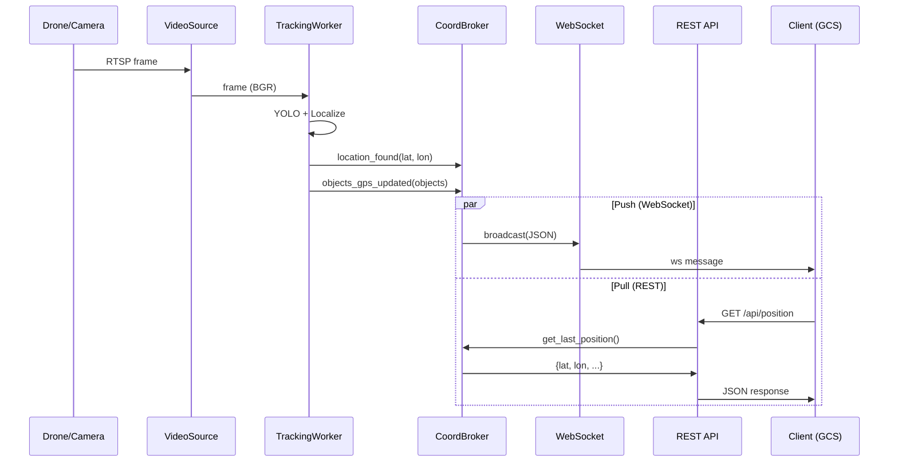

# План імплементації: Отримання координат у реальному часі

> **Версія:** 1.0  
> **Дата:** 2026-04-23  
> **Статус:** Пропозиція

---

## 1. Мета

Забезпечити можливість отримання GPS-координат дрона та відстежених об'єктів **у реальному часі** через мережевий API. Зараз система працює тільки з записаним відео та показує результати в GUI. Потрібно:

1. Підтримати **живі відеопотоки** (RTSP/RTMP/USB) як джерело кадрів.
2. Створити **мережевий API** (WebSocket + REST) для отримання координат зовнішніми системами.
3. Забезпечити **headless-режим** (без GUI) для розгортання на edge-пристроях.

---

## 2. Поточний стан

| Компонент | Поточна поведінка | Обмеження |
|---|---|---|
| Джерело відео | `QFileDialog` → шлях до `.mp4/.avi` | Тільки файли |
| `RealtimeTrackingWorker` | `cv2.VideoCapture(video_source)` | Технічно підтримує RTSP, але UI не дає ввести URL |
| Результати | `location_found` сигнал → GUI-only | Немає зовнішнього API |
| Синхронізація | `msleep(frame_duration)` для 1× відтворення файлу | Для live потоку sleep не потрібен |
| Запуск | `main.py` → `QApplication` → `MainWindow` | Тільки GUI-режим |

---

## 3. Архітектура рішення

```
┌─────────────────────────────────────────────────────────────────┐
│                    Drone / Camera                               │
│  RTSP://drone-ip:8554/stream  │  USB /dev/video0  │  .mp4 file │
└───────────────┬───────────────┴──────────┬────────┴────────────┘
                │                          │
                ▼                          ▼
┌──────────────────────────────────────────────────────┐
│              VideoSourceFactory                       │
│  Визначає тип джерела та створює cv2.VideoCapture     │
│  + конфігурує буферизацію, reconnect, timeout         │
└──────────────┬───────────────────────────────────────┘
               │
               ▼
┌──────────────────────────────────────────────────────┐
│         RealtimeTrackingWorker (існуючий)             │
│  Keyframe Localization + Optical Flow + Object Track  │
│                                                       │
│  Сигнали:                                            │
│    location_found(lat, lon, conf, inliers)           │
│    objects_gps_updated(list[ObjectGPS])               │
│    frame_ready(np.ndarray)                           │
└──────┬──────────────┬──────────────┬─────────────────┘
       │              │              │
       ▼              ▼              ▼
┌──────────┐  ┌──────────────┐  ┌─────────────────────┐
│   GUI    │  │ CoordBroker  │  │   (frame_ready)     │
│ (опц.)  │  │  (новий)     │  │   GUI VideoWidget   │
└──────────┘  └──────┬───────┘  └─────────────────────┘
                     │
          ┌──────────┴──────────┐
          │                     │
          ▼                     ▼
   ┌─────────────┐      ┌─────────────┐
   │ WebSocket   │      │  REST API   │
   │ /ws/coords  │      │ /api/pos    │
   │ (push)      │      │ (pull)      │
   └─────────────┘      └─────────────┘
          │                     │
          ▼                     ▼
   ┌─────────────────────────────────┐
   │    Зовнішні системи             │
   │  GCS, MAVLink, Mission Planner  │
   │  Web Dashboard, Mobile App      │
   └─────────────────────────────────┘
```

---

## 4. Компоненти

### 4.1 `VideoSourceFactory` — Фабрика відеоджерел

**Файл:** `src/video/video_source.py` [NEW]

Абстрагує джерело відео від `cv2.VideoCapture`:

```python
class VideoSourceType(Enum):
    FILE = "file"           # /path/to/video.mp4
    RTSP = "rtsp"           # rtsp://ip:port/stream
    RTMP = "rtmp"           # rtmp://ip/live/stream
    USB = "usb"             # device index (0, 1, ...)
    HTTP = "http"           # http://ip/mjpeg

@dataclass
class VideoSourceConfig:
    source: str
    source_type: VideoSourceType = VideoSourceType.FILE
    reconnect_attempts: int = 5
    reconnect_delay_sec: float = 2.0
    buffer_size: int = 1        # Для live: буфер 1 кадр (мінімальна затримка)
    read_timeout_sec: float = 10.0

class VideoSource:
    """Обгортка над cv2.VideoCapture з auto-reconnect та type detection."""
    
    def __init__(self, config: VideoSourceConfig):
        ...
    
    @property
    def is_live(self) -> bool:
        """True для RTSP/RTMP/USB (немає кінця потоку, немає sync-sleep)."""
    
    @property
    def fps(self) -> float:
        """FPS потоку (для live — з метаданих, для файлу — з заголовку)."""
    
    def read(self) -> tuple[bool, np.ndarray | None]:
        """Читає кадр з auto-reconnect при втраті з'єднання."""
    
    def release(self):
        ...
```

### 4.2 `CoordinatesBroker` — Розподільник координат

**Файл:** `src/network/coordinates_broker.py` [NEW]

Приймає координати від `RealtimeTrackingWorker` через Qt-сигнали та розсилає їх зовнішнім споживачам:

```python
class CoordinatesBroker(QObject):
    """Централізований брокер координат для всіх споживачів."""
    
    def __init__(self, config: dict):
        self._last_position: dict | None = None    # Остання відома позиція
        self._last_objects: list[dict] = []         # Останні об'єкти
        self._history: deque[dict] = deque(maxlen=1000)
        self._ws_server: WebSocketServer | None = None
        self._rest_server: RestApiServer | None = None
    
    @pyqtSlot(float, float, float, int)
    def on_location_found(self, lat, lon, confidence, inliers):
        """Слот підключається до tracking_worker.location_found."""
        msg = {
            "type": "position",
            "lat": lat, "lon": lon,
            "confidence": confidence,
            "inliers": inliers,
            "timestamp": time.time(),
        }
        self._last_position = msg
        self._history.append(msg)
        self._broadcast(msg)
    
    @pyqtSlot(object)
    def on_objects_gps_updated(self, objects_gps):
        """Слот для об'єктів."""
        msg = {
            "type": "objects",
            "objects": [
                {"track_id": o.track_id, "class": o.class_name,
                 "lat": o.lat, "lon": o.lon, "conf": o.confidence}
                for o in objects_gps
            ],
            "timestamp": time.time(),
        }
        self._last_objects = msg["objects"]
        self._broadcast(msg)
    
    def _broadcast(self, msg: dict):
        """Розсилає JSON по всіх активних каналах (WS, callbacks, etc.)."""
```

### 4.3 `WebSocketServer` — Push-координати по WebSocket

**Файл:** `src/network/ws_server.py` [NEW]

```python
class WebSocketServer:
    """Асинхронний WebSocket-сервер для push-координат."""
    
    def __init__(self, host="0.0.0.0", port=8765):
        ...
    
    # Клієнти підключаються до ws://host:port/ws/coords
    # Формат повідомлень: JSON
    # {
    #   "type": "position",
    #   "lat": 47.823148,
    #   "lon": 34.933040,
    #   "confidence": 0.83,
    #   "inliers": 2017,
    #   "timestamp": 1714045200.123
    # }
```

**Бібліотека:** `websockets` (стандартний asyncio WebSocket сервер).

### 4.4 `RestApiServer` — Pull-координати по HTTP

**Файл:** `src/network/rest_server.py` [NEW]

```python
class RestApiServer:
    """Легкий HTTP-сервер для REST API координат."""
    
    # GET /api/position     → остання позиція дрона
    # GET /api/objects       → останні відстежені об'єкти
    # GET /api/trajectory    → історія N останніх точок
    # GET /api/status        → стан системи (tracking/idle/error)
```

**Бібліотека:** `aiohttp` (сумісний з asyncio, легкий).

### 4.5 Зміни в існуючих файлах

#### `config/config.py`

```python
class LiveStreamConfig(BaseModel):
    enabled: bool = False
    source_type: str = "file"  # "file" | "rtsp" | "usb"
    rtsp_url: str = ""
    usb_device: int = 0
    reconnect_attempts: int = 5
    reconnect_delay_sec: float = 2.0
    buffer_size: int = 1

class NetworkApiConfig(BaseModel):
    enabled: bool = False
    ws_enabled: bool = True
    ws_host: str = "0.0.0.0"
    ws_port: int = 8765
    rest_enabled: bool = True
    rest_host: str = "0.0.0.0"
    rest_port: int = 8080
```

#### `src/workers/tracking_worker.py`

- Прийняти `VideoSource` замість `str` для `video_source`.
- Якщо `video_source.is_live`: **не робити sleep** (рядок 294-299).
- Якщо `video_source.is_live`: використати `time.time()` для dt замість `CAP_PROP_POS_MSEC`.

#### `src/gui/mixins/tracking_mixin.py`

- Додати варіант "Живий потік" у діалог: поле для RTSP URL або вибір USB-камери.
- Підключити `CoordinatesBroker` до сигналів `tracking_worker`.

#### `main.py`

- Додати `--headless` CLI-аргумент для запуску без GUI.
- Додати `--source rtsp://...` для прямого вказування джерела.

---

## 5. Протокол WebSocket

### Підключення

```
ws://localhost:8765/ws/coords
```

### Повідомлення від сервера (push)

```json
{
  "type": "position",
  "lat": 47.823148,
  "lon": 34.933040,
  "confidence": 0.83,
  "inliers": 2017,
  "timestamp": 1714045200.123,
  "matched_frame": 777
}
```

```json
{
  "type": "objects",
  "objects": [
    {"track_id": 1, "class": "car", "lat": 47.8231, "lon": 34.9331, "conf": 0.92},
    {"track_id": 3, "class": "person", "lat": 47.8230, "lon": 34.9329, "conf": 0.87}
  ],
  "timestamp": 1714045200.456
}
```

### Команди від клієнта (pull)

```json
{"cmd": "get_position"}
{"cmd": "get_objects"}
{"cmd": "get_trajectory", "limit": 100}
{"cmd": "get_status"}
```

---

## 6. REST API Endpoints

| Метод | Шлях | Опис | Відповідь |
|---|---|---|---|
| `GET` | `/api/position` | Остання позиція дрона | `{"lat": 47.82, "lon": 34.93, "confidence": 0.83, "timestamp": ...}` |
| `GET` | `/api/objects` | Останні відстежені об'єкти | `[{"track_id": 1, "class": "car", ...}]` |
| `GET` | `/api/trajectory?limit=100` | Історія траєкторії | `[{"lat": ..., "lon": ..., "timestamp": ...}, ...]` |
| `GET` | `/api/status` | Стан системи | `{"state": "tracking", "fps": 6.2, "uptime_sec": 120}` |

---

## 7. Поетапний план

### Фаза 1: Підтримка live-потоків (без API)

| # | Задача | Файл |
|---|---|---|
| 1.1 | Створити `VideoSource` з auto-reconnect | `src/video/video_source.py` [NEW] |
| 1.2 | Додати `LiveStreamConfig` | `config/config.py` |
| 1.3 | Адаптувати `RealtimeTrackingWorker` для `VideoSource` | `tracking_worker.py` |
| 1.4 | UI: діалог для введення RTSP URL або вибору USB | `tracking_mixin.py` |

### Фаза 2: Мережевий API

| # | Задача | Файл |
|---|---|---|
| 2.1 | Створити `CoordinatesBroker` | `src/network/coordinates_broker.py` [NEW] |
| 2.2 | Реалізувати `WebSocketServer` | `src/network/ws_server.py` [NEW] |
| 2.3 | Реалізувати `RestApiServer` | `src/network/rest_server.py` [NEW] |
| 2.4 | Підключити broker у `tracking_mixin.py` | `tracking_mixin.py` |
| 2.5 | Додати `NetworkApiConfig` | `config/config.py` |

### Фаза 3: Headless-режим

| # | Задача | Файл |
|---|---|---|
| 3.1 | CLI-аргументи (`--headless`, `--source`, `--project`) | `main.py` |
| 3.2 | `HeadlessRunner` — запуск без GUI | `src/core/headless_runner.py` [NEW] |
| 3.3 | Docker-файл для edge-розгортання | `Dockerfile` [NEW] |

---

## 8. Нові залежності

| Пакет | Версія | Призначення | Розмір |
|---|---|---|---|
| `websockets` | `>=12.0` | WebSocket сервер (asyncio) | ~0.5 MB |
| `aiohttp` | `>=3.9` | REST API сервер (asyncio) | ~2 MB |

> Обидві бібліотеки — pure Python / asyncio, не потребують GPU чи C-компіляції.

---

## 9. Діаграма потоку даних



---

## 10. Адаптація TrackingWorker для live

Ключові зміни в `run()`:

```python
# Замість:
cap = cv2.VideoCapture(self.video_source)  # str path
frame_duration_sec = 1.0 / video_fps
# ...
sleep_time = frame_duration_sec - elapsed_in_loop
if sleep_time > 0:
    self.msleep(int(sleep_time * 1000))  # ← блокує для файлів

# Стає:
video_src = self.video_source  # VideoSource object
# ...
if not video_src.is_live:
    # Синхронізація тільки для файлів
    elapsed_in_loop = time.time() - loop_start
    sleep_time = frame_duration_sec - elapsed_in_loop
    if sleep_time > 0:
        self.msleep(int(sleep_time * 1000))

# Для live: dt рахується по wall-clock time, а не по відео-часу
if video_src.is_live:
    current_video_time_sec = time.time() - stream_start_time
```

---

## 11. Headless-режим

```bash
# З GUI (поточна поведінка):
python main.py

# Без GUI + RTSP + API:
python main.py --headless \
    --project "D:/Projects/TEST/testlast" \
    --source "rtsp://192.168.1.100:8554/stream" \
    --ws-port 8765 \
    --rest-port 8080

# Без GUI + USB камера:
python main.py --headless \
    --project "D:/Projects/TEST/testlast" \
    --source "usb:0" \
    --ws-port 8765
```

---

## 12. Приклад клієнта (Python)

```python
import asyncio
import websockets
import json

async def track_drone():
    async with websockets.connect("ws://localhost:8765/ws/coords") as ws:
        async for message in ws:
            data = json.loads(message)
            if data["type"] == "position":
                print(f"Drone at {data['lat']:.6f}, {data['lon']:.6f} "
                      f"(conf: {data['confidence']:.2f})")
            elif data["type"] == "objects":
                for obj in data["objects"]:
                    print(f"  {obj['class']} #{obj['track_id']} "
                          f"at {obj['lat']:.6f}, {obj['lon']:.6f}")

asyncio.run(track_drone())
```

---

## 13. Оцінка

| Фаза | Складність | Час |
|---|---|---|
| Фаза 1: Live-потоки | Середня | 1-2 дні |
| Фаза 2: Мережевий API | Середня | 1-2 дні |
| Фаза 3: Headless-режим | Низька | 0.5-1 день |
| **Разом** | | **~3-5 днів** |

---

## 14. Верифікація

### Фаза 1
- Підключення до RTSP-потоку з IP-камери або `ffmpeg`-симуляції
- Перевірка auto-reconnect при обриві з'єднання
- Коректний dt для live (wall-clock замість відео-часу)

### Фаза 2
- WebSocket: підключитися клієнтом і отримати координати в реальному часі
- REST: `curl http://localhost:8080/api/position` → JSON з координатами
- Навантаження: 10+ одночасних WS-клієнтів без деградації

### Фаза 3
- `python main.py --headless --source "test.mp4" --project "..."`
- Перевірити що працює без X11/Wayland/Display
